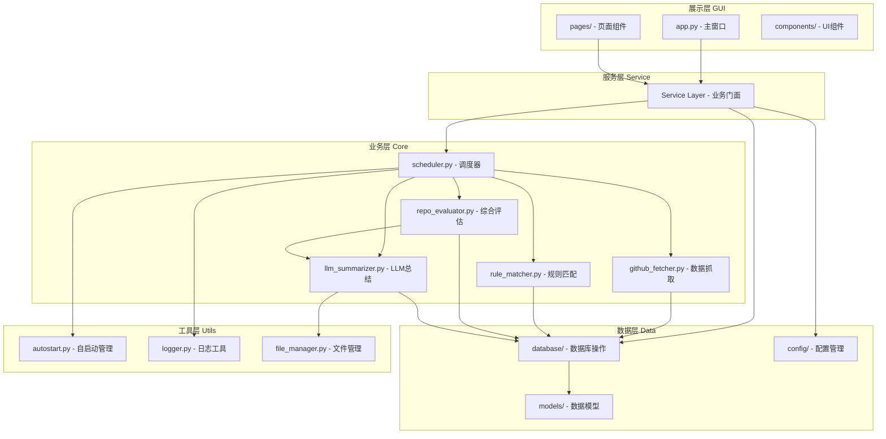
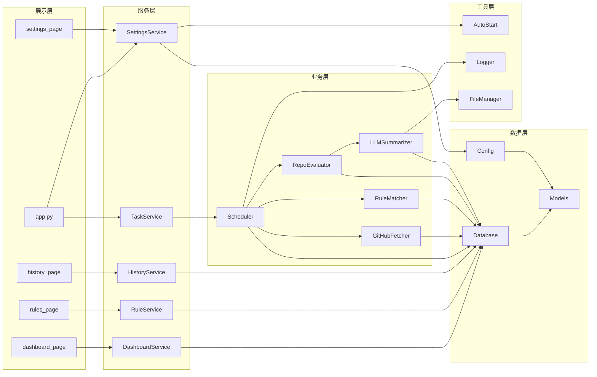
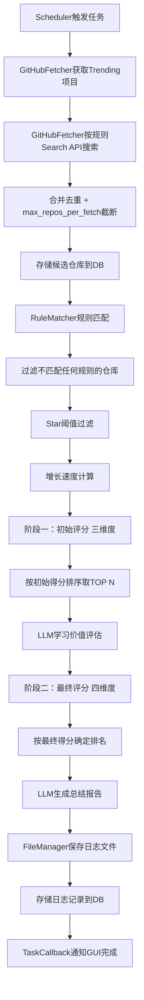
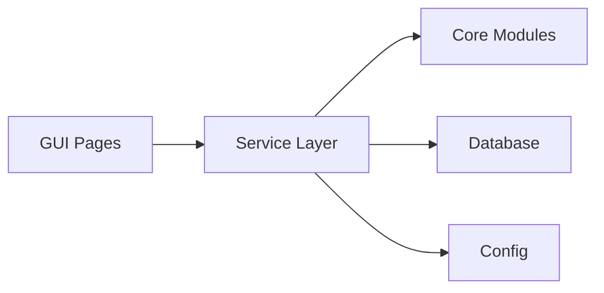
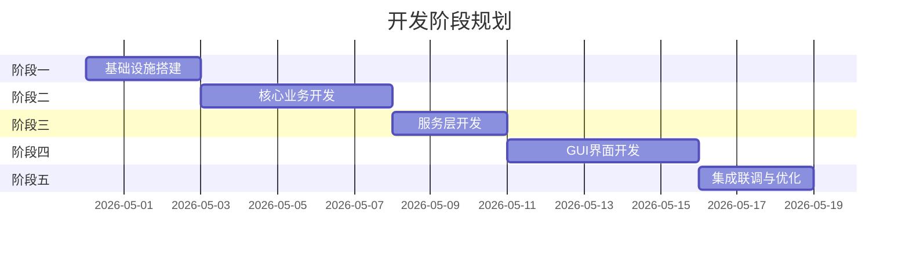

# GitHub热点推送 - 项目开发文档

> 本文档基于《项目设计文档》v1.15.0 编写，作为项目开发团队的执行指南，确保开发工作有序推进并符合项目设计要求。

***

## 1. 项目概述与需求分析

### 1.1 项目背景与目标

GitHub是全球最大的开源代码托管平台，每天有大量优质项目涌现。然而，手动从海量仓库中发现符合自身需求且具有学习价值的热门项目耗时费力。

**GitHub热点推送**（GitHub Trending Pusher）是一个桌面端自动化工具，通过**自动化抓取 + 智能规则匹配 + 综合评估筛选 + LLM总结**的方式，从增长较快的项目中精选出最优质的N个，帮助用户高效获取个性化的GitHub热门项目推送，降低信息筛选成本。

**项目核心目标**：

| 目标 | 描述 |
| --- | --- |
| 自动化抓取 | 从GitHub获取star增长较快的热门开源项目，不限创建时间，关注增长趋势与质量 |
| 智能筛选 | 结合规则匹配、star阈值、增长速度和LLM学习价值评估，综合评分后选取TOP N项目 |
| 结构化总结 | 通过大语言模型对筛选出的优质项目生成结构化总结（含仓库链接、介绍、应用举例） |
| 便捷管理 | 提供美观的图形界面，用于规则管理、参数配置、推送数量设置、历史查看 |

### 1.2 核心功能需求清单

| 编号 | 功能模块 | 功能描述 | 优先级 |
| --- | --- | --- | --- |
| F1 | GitHub热门项目抓取 | 从GitHub Trending页面和Search API获取star增长较快的热门开源项目 | P0 |
| F2 | 综合评估与筛选 | 结合规则匹配度、Star阈值达标度、增长速度、学习价值四维度综合评分，选取TOP N项目（默认10个，GUI可调） | P0 |
| F3 | LLM总结生成 | 通过GLM-4.7对筛选出的优质项目生成结构化总结报告（含仓库链接、介绍、学习价值、应用举例） | P0 |
| F4 | 总结日志保存 | 将生成的总结日志保存到用户指定的本地路径，Markdown格式 | P0 |
| F5 | GUI管理界面 | 提供美观的图形界面，含仪表盘、规则管理、历史记录、系统设置四个页面 | P0 |
| F6 | 开机自启动 | 支持在GUI中切换是否开机自动启动（Windows注册表实现） | P1 |

### 1.3 非功能性需求

#### 1.3.1 性能需求

| 需求项 | 指标 |
| --- | --- |
| GitHub API调用频率 | 未认证≤1次/分钟，认证后≤30次/分钟（应用自身保守限制） |
| LLM API调用超时 | 60秒，超时后自动重试一次 |
| 单次推送任务执行时间 | 不超过5分钟 |
| GUI响应性 | 耗时操作（网络请求、LLM调用）必须在后台线程执行，不阻塞主线程 |

#### 1.3.2 安全需求

| 需求项 | 描述 |
| --- | --- |
| API Key存储 | 禁止硬编码在源代码中，GUI展示时掩码处理，支持环境变量传入 |
| GitHub Token权限 | 仅申请最小权限（`public_repo`），不执行任何写操作 |
| HTTP请求 | 必须使用HTTPS |
| 数据库文件 | 存储在用户目录，不在代码仓库中 |

#### 1.3.3 兼容性需求

| 需求项 | 指标 |
| --- | --- |
| 目标平台 | Windows 10/11（主要支持） |
| Python版本 | 3.10及以上 |
| 屏幕分辨率 | 最低支持1366×768 |
| 运行权限 | 不依赖系统管理员权限 |

### 1.4 需求确认流程与验收标准

#### 需求确认流程

```
需求提出 → 需求评审（对照设计文档） → 需求确认 → 开发实现 → 功能验收
```

1. **需求提出**：以功能需求清单为基准，任何变更需记录到设计文档改动信息章节
2. **需求评审**：对照《项目设计文档》验证需求的技术可行性和架构一致性
3. **需求确认**：确认后锁定需求基线，进入开发阶段
4. **功能验收**：按验收标准逐项验证

#### 验收标准

| 功能模块 | 验收标准 |
| --- | --- |
| GitHub热门项目抓取 | 能成功获取Trending项目和Search API项目，合并去重后存储到数据库 |
| 综合评估与筛选 | 四维度评分算法正确实现，两阶段评分逻辑与设计文档一致 |
| LLM总结生成 | 能成功调用GLM-4.7生成学习价值评估和结构化总结报告 |
| 总结日志保存 | 日志文件保存到用户指定路径，格式为Markdown |
| GUI管理界面 | 四个页面功能完整，主题切换正常，首次引导流程正常 |
| 开机自启动 | 开关切换正常，注册表操作正确 |

***

## 2. 系统架构设计

### 2.1 整体架构

本项目采用**五层架构**设计，严格遵循单向依赖原则：



**分层原则**：

- **展示层**只负责UI渲染和用户交互，不包含业务逻辑，通过服务层间接调用业务层
- **服务层**作为业务门面（Facade），封装业务层接口，为展示层提供统一调用入口
- **业务层**负责核心业务处理，不直接操作数据库（通过数据层）
- **数据层**负责数据持久化和配置管理
- **工具层**提供通用辅助能力，被各层调用
- 严格遵循**单向依赖**：展示层 → 服务层 → 业务层 → 数据层，禁止反向依赖

### 2.2 模块划分与职责

| 层级 | 模块 | 文件 | 职责 |
| --- | --- | --- | --- |
| 展示层 | 主窗口 | `gui/app.py` | 主窗口框架、侧边栏导航、全局操作（立即执行、开机自启）、系统托盘 |
| 展示层 | 仪表盘页面 | `gui/pages/dashboard_page.py` | 推送概览统计、TOP 5项目列表、最新推送日志 |
| 展示层 | 规则管理页面 | `gui/pages/rules_page.py` | 规则列表展示、新建/编辑/删除/启禁用规则 |
| 展示层 | 历史记录页面 | `gui/pages/history_page.py` | 历史日志列表、搜索、查看/打开/删除日志 |
| 展示层 | 设置页面 | `gui/pages/settings_page.py` | GitHub/LLM/输出/评估/应用配置 |
| 展示层 | 公共组件 | `gui/components/widgets.py` | 自定义UI组件（进度条、卡片、弹窗等） |
| 服务层 | 仪表盘服务 | `service/dashboard_service.py` | 获取推送统计、TOP项目、最新日志 |
| 服务层 | 规则管理服务 | `service/rule_service.py` | 规则CRUD操作、启禁用 |
| 服务层 | 历史记录服务 | `service/history_service.py` | 历史日志查询、搜索、删除、文件打开 |
| 服务层 | 设置管理服务 | `service/settings_service.py` | 配置读写、连接测试、自启动管理、评估配置 |
| 服务层 | 任务执行服务 | `service/task_service.py` | 立即执行、任务状态查询、取消任务 |
| 业务层 | 数据抓取器 | `core/github_fetcher.py` | GitHub Trending抓取、Search API查询 |
| 业务层 | 规则匹配引擎 | `core/rule_matcher.py` | 规则匹配度计算、匹配记录存储 |
| 业务层 | 综合评估器 | `core/repo_evaluator.py` | 两阶段评分、Star阈值过滤、增长速度计算 |
| 业务层 | LLM总结生成器 | `core/llm_summarizer.py` | 学习价值评估、总结报告生成 |
| 业务层 | 定时调度器 | `core/scheduler.py` | APScheduler定时任务、任务编排协调 |
| 数据层 | 数据库连接 | `database/connection.py` | SQLite连接管理、初始化 |
| 数据层 | CRUD操作 | `database/crud.py` | 通用数据库CRUD操作 |
| 数据层 | 数据库迁移 | `database/migrations.py` | 版本管理、迁移执行 |
| 数据层 | 配置管理 | `config/settings.py` | 单例配置管理、加载/保存/环境变量覆盖 |
| 数据层 | 仓库模型 | `models/repository.py` | 仓库数据Pydantic模型 |
| 数据层 | 规则模型 | `models/rule.py` | 规则数据Pydantic模型 |
| 数据层 | 评估模型 | `models/evaluation.py` | 评估结果Pydantic模型 |
| 数据层 | 总结模型 | `models/summary.py` | 总结日志Pydantic模型 |
| 工具层 | 自启动管理 | `utils/autostart.py` | Windows注册表操作、开机自启管理 |
| 工具层 | 日志工具 | `utils/logger.py` | loguru日志配置 |
| 工具层 | 文件管理 | `utils/file_manager.py` | 文件保存、目录操作 |
| 工具层 | 辅助函数 | `utils/helpers.py` | 通用辅助函数 |

### 2.3 模块间依赖关系



### 2.4 数据流设计

#### 2.4.1 核心推送任务数据流



#### 2.4.2 GUI交互数据流

```
用户操作 → GUI页面 → Service层 → Core/Database/Config → 返回结果 → GUI更新
```

- GUI页面不直接调用Core模块，统一通过Service层
- Service层封装业务逻辑，处理异常转换
- 耗时操作通过后台线程执行，通过TaskCallback回调通知GUI

***

## 3. 技术选型与决策

### 3.1 语言与运行时

| 类别 | 选型 | 版本要求 | 决策理由 |
| --- | --- | --- | --- |
| 编程语言 | Python | 3.10+ | 生态丰富，开发效率高，支持类型注解（`list[str]`替代`List[str]`）、`match/case`等现代语法 |

### 3.2 GUI框架

| 类别 | 选型 | 版本 | 决策理由 |
| --- | --- | --- | --- |
| GUI框架 | CustomTkinter | 5.2+ | 基于tkinter的现代UI框架，原生支持深色/浅色主题，轻量美观 |
| 图标库 | Pillow | 10.0+ | 图标和图片处理 |

**CustomTkinter选型对比**：

| 对比项 | CustomTkinter | PyQt5/6 | Electron/Flask+浏览器 |
| --- | --- | --- | --- |
| 安装方式 | pip一键安装 | 需安装Qt运行时 | 需浏览器依赖 |
| 打包体积 | 小 | 大 | 很大 |
| 主题支持 | 原生深色/浅色 | 需额外配置 | 需自行实现 |
| 学习成本 | 低 | 高 | 中 |
| 桌面体验 | 原生 | 原生 | Web体验 |

### 3.3 核心依赖

| 类别 | 选型 | 版本 | 决策理由 |
| --- | --- | --- | --- |
| GitHub API | PyGitHub | 2.1+ | GitHub REST API的Python封装，用于搜索仓库、获取仓库详情和README内容等标准API调用 |
| HTTP请求 | httpx | 0.25+ | 用于GitHub Trending页面抓取（无官方API的页面解析）和LLM API调用；同步模式+后台线程，简化错误处理 |
| HTML解析 | BeautifulSoup4 | 4.12+ | 解析GitHub Trending页面HTML，提取趋势项目信息 |
| LLM集成 | openai | 1.0+ | 通过OpenAI兼容协议调用多家代理厂家的LLM API |
| 定时任务 | APScheduler | 3.10+ | 轻量级Python定时任务调度框架，无需外部依赖 |
| 数据存储 | SQLite | 内置 | 轻量、零配置、单文件存储，适合桌面应用 |
| 配置管理 | pydantic | 2.0+ | 配置模型校验和序列化，类型安全 |

### 3.4 辅助依赖

| 类别 | 选型 | 版本 | 决策理由 |
| --- | --- | --- | --- |
| 日志 | loguru | 0.7+ | 美观易用的日志库，开箱即用 |
| 开机自启 | pywin32 | 306+ | Windows注册表操作，实现开机自启动管理 |
| 打包 | PyInstaller | 6.0+ | 将项目打包为Windows可执行文件 |
| 数据处理 | orjson | 3.9+ | 高性能JSON序列化/反序列化 |

### 3.5 第三方服务

| 服务 | 提供方 | 用途 | 决策理由 |
| --- | --- | --- | --- |
| GitHub REST API | GitHub | 搜索和获取仓库信息 | 官方API，数据准确，认证后5000次/小时 |
| GitHub Trending | GitHub | 获取热门趋势项目 | 唯一的趋势数据来源，提供增长数据 |
| OpenAI兼容LLM API | 多家代理厂家 | 提供大模型API服务（火山方舟、DeepSeek、智谱AI等） | OpenAI兼容协议，接入简单，用户可自由选择厂家和模型 |

### 3.6 依赖版本锁定

```
customtkinter>=5.2.0
Pillow>=10.0.0
PyGitHub>=2.1.0
httpx>=0.25.0
beautifulsoup4>=4.12.0
openai>=1.0.0
APScheduler>=3.10.0
pydantic>=2.0.0
loguru>=0.7.0
orjson>=3.9.0
pywin32>=306; sys_platform == 'win32'
PyInstaller>=6.0.0
```

***

## 4. 开发环境搭建

### 4.1 Python环境配置

1. **安装Python 3.10+**
   - 从 [python.org](https://www.python.org/downloads/) 下载安装
   - 安装时勾选 "Add Python to PATH"
   - 验证安装：`python --version`（应显示3.10+）

2. **确认pip可用**
   ```bash
   python -m pip --version
   ```

### 4.2 虚拟环境与依赖安装

```bash
# 进入项目源代码目录
cd Code/

# 创建虚拟环境
python -m venv venv

# 激活虚拟环境（Windows）
venv\Scripts\activate

# 安装依赖
pip install -r requirements.txt
```

**requirements.txt 内容**：

```
customtkinter>=5.2.0
Pillow>=10.0.0
PyGitHub>=2.1.0
httpx>=0.25.0
beautifulsoup4>=4.12.0
openai>=1.0.0
APScheduler>=3.10.0
pydantic>=2.0.0
loguru>=0.7.0
orjson>=3.9.0
pywin32>=306; sys_platform == 'win32'
PyInstaller>=6.0.0
```

### 4.3 IDE配置

推荐使用 **Trae IDE**（AI辅助开发）或 **VS Code**：

| 配置项 | 推荐设置 |
| --- | --- |
| Python解释器 | 指向 `Code/venv/Scripts/python.exe` |
| 代码格式化 | 使用 `autopep8` 或 `black` |
| 类型检查 | 启用 `pyright` 或 `mypy` |
| 编码格式 | UTF-8 |
| 换行符 | LF |

### 4.4 数据库初始化

数据库在应用首次启动时自动创建和初始化，无需手动操作：

- 数据库文件路径：`{APP_DATA_DIR}/data/github_pusher.db`
- 初始化脚本：`Code/migrations/v1_init.py`
- 启动时自动检测数据库版本并执行必要迁移

### 4.5 配置文件准备

1. 默认配置模板位于 `Code/config/default_config.json`
2. 首次启动时自动从模板复制生成 `Code/config/app_config.json`
3. 需要用户填写的配置项：
   - `github.token`：GitHub Personal Access Token（仅需`public_repo`权限）
   - `llm.api_key`：对应代理厂家的API Key

**也可通过环境变量配置**：

```bash
set GITHUB_TOKEN=ghp_xxxxxxxxxxxx
set VOLCENGINE_API_KEY=sk-sp-xxx
```

环境变量优先级：环境变量 > 配置文件 > 默认值

***

## 5. 编码规范

### 5.1 代码风格规范

- 严格遵循 **PEP 8** 编码规范
- 使用 Python 3.10+ 语法特性（如 `list[str]` 而非 `List[str]`，`match/case` 等）
- 单行代码长度不超过 **120** 字符
- 文件末尾保留一个空行
- 使用 **4个空格** 缩进，禁止Tab

### 5.2 命名规范

| 类别 | 规范 | 示例 |
| --- | --- | --- |
| 模块名 | 全小写，下划线分隔 | `github_fetcher.py` |
| 类名 | 大驼峰（PascalCase） | `GitHubFetcher`, `RuleMatcher` |
| 函数名 | 小写下划线（snake_case） | `fetch_trending_repos()` |
| 常量名 | 全大写下划线 | `MAX_REPOS_PER_FETCH` |
| 私有方法 | 前缀单下划线 | `_build_search_query()` |
| 配置键 | 小写下划线 | `fetch_interval_hours` |
| 数据库表名 | 复数小写下划线 | `match_records` |
| 数据库字段 | 小写下划线 | `created_at` |

### 5.3 注释规范

本项目严格要求编写以下三类注释：

#### 5.3.1 类注释

```python
class GitHubFetcher:
    """GitHub热门项目数据抓取器。

    负责从GitHub Search API和Trending页面获取热门开源项目数据，
    支持按语言、主题、star数等多维度筛选，并自动处理API速率限制。

    Attributes:
        token: GitHub Personal Access Token，用于API认证。
        client: httpx同步客户端实例（耗时操作在后台线程中执行，无需异步）。
    """
```

#### 5.3.2 业务函数注释

```python
def fetch_trending_repos(self, languages: list[str] | None = None, since: str = "daily") -> list[dict]:
    """获取GitHub趋势项目列表。

    通过抓取GitHub Trending页面和调用Search API，获取指定时间段内
    star增长最快的项目列表。当Trending页面抓取失败时，自动降级为
    Search API查询。

    Args:
        languages: 编程语言筛选列表，None或空列表表示所有语言。
        since: 时间范围，可选 daily/weekly/monthly。

    Returns:
        包含仓库信息的字典列表，每个字典包含 full_name、description、
        url、homepage、stars、stars_growth、forks、language、topics、
        fetched_at 等字段。

    Raises:
        GitHubAPIError: 当API调用失败且降级方案也失败时抛出。
    """
```

#### 5.3.3 函数注释

```python
def _build_search_query(self, keywords: list[str], topics: list[str] | None = None, language: str = "") -> str:
    """构造GitHub Search API查询语句。"""
```

### 5.4 异常处理规范

#### 5.4.1 异常类体系

```python
class AppError(Exception):
    """应用基础异常类。"""
    def __init__(self, code: int, message: str):
        self.code = code
        self.message = message
        super().__init__(self.message)

class GitHubAPIError(AppError):    # 错误码 1001-1999
class LLMError(AppError):          # 错误码 2001-2999
class DatabaseError(AppError):     # 错误码 3001-3999
class EvalError(AppError):         # 错误码 3501-3599
class RuleError(AppError):         # 错误码 4001-4999
class FileError(AppError):         # 错误码 5001-5999
class AutoStartError(AppError):    # 错误码 6001-6999
```

#### 5.4.2 处理原则

- 业务层抛出具体异常，不吞没异常
- 展示层捕获异常并展示友好提示
- 外部API调用必须有超时和重试机制
- 所有异常记录到日志文件
- 异常类按业务大类定义，细分场景通过错误码区分

#### 5.4.3 错误码定义

| 错误码 | 名称 | 说明 |
| --- | --- | --- |
| 1001 | GITHUB_API_ERROR | GitHub API调用失败 |
| 1002 | GITHUB_RATE_LIMIT | GitHub API速率限制 |
| 1003 | GITHUB_TOKEN_INVALID | GitHub Token无效 |
| 2001 | LLM_API_ERROR | LLM API调用失败 |
| 2002 | LLM_TIMEOUT | LLM响应超时 |
| 2003 | LLM_API_KEY_INVALID | LLM API Key无效 |
| 3001 | DB_ERROR | 数据库操作失败 |
| 3501 | EVAL_ERROR | 综合评估计算失败 |
| 3502 | EVAL_WEIGHT_INVALID | 评估权重配置无效（权重之和不为1.0） |
| 4001 | RULE_INVALID | 规则配置无效 |
| 4002 | RULE_NOT_FOUND | 规则不存在 |
| 5001 | FILE_SAVE_ERROR | 文件保存失败 |
| 5002 | DIR_NOT_FOUND | 输出目录不存在 |
| 6001 | AUTOSTART_ERROR | 开机自启动设置失败 |

### 5.5 日志规范

```python
from loguru import logger

logger.add(
    "logs/app_{time:YYYY-MM-DD}.log",
    rotation="1 day",
    retention="30 days",
    level="INFO",
    format="{time:YYYY-MM-DD HH:mm:ss} | {level} | {module}:{function}:{line} | {message}"
)
```

**日志级别使用规范**：

| 级别 | 使用场景 |
| --- | --- |
| DEBUG | 调试信息，如API请求/响应详情 |
| INFO | 正常业务流程，如任务开始/完成 |
| WARNING | 可恢复的异常，如API降级 |
| ERROR | 不可恢复的异常，如数据库连接失败 |
| CRITICAL | 系统级故障，如配置文件损坏 |

***

## 6. 前后端接口设计

### 6.1 接口设计原则

本项目为桌面GUI应用，不涉及HTTP前端请求。前后端通信通过**Python模块间直接调用**实现，封装为统一的Service层。

**核心原则**：

1. **展示层不直接调用业务层**：GUI页面只能通过Service层间接调用
2. **Service层作为业务门面**：封装业务层接口，为展示层提供统一调用入口
3. **单向数据流**：GUI → Service → Core/Database/Config
4. **异常转换**：Service层捕获业务异常，转换为用户友好的错误消息



### 6.2 DashboardService 接口定义

| 方法 | 返回类型 | 描述 |
| --- | --- | --- |
| `get_today_stats()` | `DashboardStats` | 获取最近一次推送任务的统计概览 |
| `get_top_repos(limit)` | `list[RepoInfo]` | 获取综合评估TOP N项目 |
| `get_latest_summary()` | `SummaryInfo | None` | 获取最新推送日志 |

#### 6.2.1 get_today_stats()

**描述**：获取最近一次推送任务的统计概览。数据来源于最近一条`summary_logs`记录，若尚无任务记录则返回全零值。

**返回数据结构**：

```python
class DashboardStats(BaseModel):
    candidate_count: int      # 候选项目数（步骤1合并去重后的仓库总数）
    matched_count: int        # 匹配仓库数（步骤2规则匹配过滤后未被过滤的仓库数）
    recommended_count: int    # 推荐项目数（最终TOP N项目数）
```

#### 6.2.2 get_top_repos(limit: int)

**描述**：获取综合评估得分最高的N个项目。

**请求参数**：

| 参数 | 类型 | 必填 | 说明 |
| --- | --- | --- | --- |
| limit | int | 是 | 返回项目数量 |

**返回数据结构**：

```python
class RepoInfo(BaseModel):
    id: int
    full_name: str
    description: str
    url: str
    stars: int
    stars_growth: int
    language: str
    eval_score: float
    readme_summary: str
```

#### 6.2.3 get_latest_summary()

**描述**：获取最新一条推送日志信息。

**返回数据结构**：

```python
class SummaryInfo(BaseModel):
    id: int
    title: str
    repo_count: int
    generated_at: str
    file_path: str
```

### 6.3 RuleService 接口定义

| 方法 | 返回类型 | 描述 |
| --- | --- | --- |
| `get_rules(enabled_only)` | `list[RuleInfo]` | 获取规则列表 |
| `add_rule(rule_data)` | `RuleInfo` | 新增规则 |
| `update_rule(rule_id, rule_data)` | `RuleInfo` | 更新规则 |
| `delete_rule(rule_id)` | `None` | 删除规则（级联删除关联的match_records） |
| `toggle_rule(rule_id, enabled)` | `None` | 启用/禁用规则 |

#### 6.3.1 get_rules(enabled_only: bool = False)

**请求参数**：

| 参数 | 类型 | 必填 | 默认值 | 说明 |
| --- | --- | --- | --- | --- |
| enabled_only | bool | 否 | False | 是否仅返回启用的规则 |

**返回数据结构**：

```python
class RuleInfo(BaseModel):
    id: int
    name: str
    keywords: list[str]
    topics: list[str]
    language: str
    min_stars: int
    priority: int
    enabled: bool
    created_at: str
    updated_at: str
```

#### 6.3.2 add_rule(rule_data: RuleCreateData)

**请求数据结构**：

```python
class RuleCreateData(BaseModel):
    name: str                  # 规则名称，NOT NULL, UNIQUE
    keywords: list[str]        # 关键词列表，NOT NULL
    topics: list[str] = []     # GitHub主题标签
    language: str = ""         # 编程语言筛选，空字符串表示不限
    min_stars: int = 0         # 最低star数（0表示使用全局配置值）
    priority: int = 5          # 优先级权重（1-10）
    enabled: bool = True       # 是否启用
```

**返回**：同 `RuleInfo`

#### 6.3.3 update_rule(rule_id: int, rule_data: RuleUpdateData)

**请求数据结构**：

```python
class RuleUpdateData(BaseModel):
    name: str | None = None
    keywords: list[str] | None = None
    topics: list[str] | None = None
    language: str | None = None
    min_stars: int | None = None
    priority: int | None = None
    enabled: bool | None = None
```

**返回**：同 `RuleInfo`

#### 6.3.4 delete_rule(rule_id: int)

**描述**：删除规则，级联删除关联的`match_records`记录。

#### 6.3.5 toggle_rule(rule_id: int, enabled: bool)

**描述**：启用或禁用规则。

### 6.4 HistoryService 接口定义

| 方法 | 返回类型 | 描述 |
| --- | --- | --- |
| `get_summaries(page, size)` | `PaginatedResult[SummaryDetail]` | 分页获取历史日志 |
| `search_summaries(keyword, page, size)` | `PaginatedResult[SummaryDetail]` | 按关键词搜索历史日志 |
| `get_summary_detail(log_id)` | `SummaryDetail` | 获取日志详情 |
| `delete_summary(log_id)` | `None` | 删除日志（同时删除数据库记录、关联的summary_repos记录、磁盘上的日志文件） |
| `open_file(file_path)` | `None` | 用系统默认程序打开文件 |
| `open_directory(dir_path)` | `None` | 打开目录 |

#### 6.4.1 get_summaries(page: int = 1, size: int = 10)

**请求参数**：

| 参数 | 类型 | 必填 | 默认值 | 说明 |
| --- | --- | --- | --- | --- |
| page | int | 否 | 1 | 页码 |
| size | int | 否 | 10 | 每页数量 |

**返回数据结构**：

```python
class SummaryDetail(BaseModel):
    id: int
    title: str
    content: str
    file_path: str
    repo_count: int
    candidate_count: int
    matched_count: int
    generated_at: str

class PaginatedResult(BaseModel, Generic[T]):
    items: list[T]
    total: int
    page: int
    size: int
    total_pages: int
```

#### 6.4.2 search_summaries(keyword: str, page: int = 1, size: int = 10)

**请求参数**：

| 参数 | 类型 | 必填 | 说明 |
| --- | --- | --- | --- |
| keyword | str | 是 | 搜索关键词 |
| page | int | 否 | 页码 |
| size | int | 否 | 每页数量 |

**返回**：同 `PaginatedResult[SummaryDetail]`

#### 6.4.3 delete_summary(log_id: int)

**描述**：删除总结日志，同时执行以下操作：
1. 删除`summary_logs`表记录
2. 级联删除`summary_repos`表关联记录
3. 删除磁盘上的日志文件

### 6.5 SettingsService 接口定义

| 方法 | 返回类型 | 描述 |
| --- | --- | --- |
| `get_settings()` | `AppConfig` | 获取当前完整配置 |
| `save_settings(settings_data)` | `None` | 保存配置 |
| `restore_default_settings()` | `None` | 恢复所有配置为默认值 |
| `test_github_connection()` | `ConnectionTestResult` | 测试GitHub连接 |
| `test_llm_connection()` | `ConnectionTestResult` | 测试LLM连接 |
| `set_autostart(enabled)` | `None` | 设置开机自启动 |
| `get_evaluation_config()` | `EvaluationConfig` | 获取评估配置 |
| `save_evaluation_config(config)` | `None` | 保存评估配置 |

#### 6.5.1 get_settings()

**返回数据结构**：

```python
class AppConfig(BaseModel):
    github: GitHubConfig
    llm: LLMConfig
    evaluation: EvaluationConfig
    output: OutputConfig
    scheduler: SchedulerConfig
    autostart: AutoStartConfig
    app: AppUIConfig

class GitHubConfig(BaseModel):
    token: str = ""
    fetch_interval_hours: int = 24
    max_repos_per_fetch: int = 50
    trending_languages: list[str] = ["python", "javascript", "typescript", "go", "rust"]
    min_stars: int = 100
    growth_period: str = "daily"

class LLMConfig(BaseModel):
    provider: str = "volcengine"
    base_url: str = "https://ark.cn-beijing.volces.com/api/v3"
    api_key: str = ""
    model: str = "GLM-4.7"
    temperature: float = 0.7
    max_tokens: int = 4096

class EvaluationConfig(BaseModel):
    top_n: int = 10
    weights: EvalWeights

class EvalWeights(BaseModel):
    rule_match: float = 0.3
    star_threshold: float = 0.2
    growth_speed: float = 0.2
    learning_value: float = 0.3

class OutputConfig(BaseModel):
    save_dir: str = ""
    format: str = "markdown"
    filename_template: str = "github_trending_{date}.md"

class SchedulerConfig(BaseModel):
    enabled: bool = True
    run_time: str = "09:00"
    timezone: str = "Asia/Shanghai"

class AutoStartConfig(BaseModel):
    enabled: bool = False

class AppUIConfig(BaseModel):
    theme: str = "system"
    language: str = "zh_CN"
    minimize_to_tray: bool = True
```

#### 6.5.2 test_github_connection() / test_llm_connection()

**返回数据结构**：

```python
class ConnectionTestResult(BaseModel):
    success: bool
    message: str       # 成功时为"连接成功"，失败时为具体错误原因和修复建议
    latency_ms: int    # 响应延迟（毫秒），失败时为-1
```

#### 6.5.3 get_evaluation_config() / save_evaluation_config(config)

**描述**：便捷方法，专门操作`evaluation`配置段。与`get_settings()`/`save_settings()`操作同一份配置文件，**禁止**通过两种方式同时修改评估配置以避免覆盖。

**EvaluationConfig 结构**：同上方定义。

### 6.6 TaskService 接口定义

| 方法 | 返回类型 | 描述 |
| --- | --- | --- |
| `run_task_now()` | `None` | 立即执行推送任务（异步执行，在后台线程中运行） |
| `get_task_status()` | `TaskStatus` | 获取任务执行状态 |
| `cancel_task()` | `None` | 取消正在执行的任务 |
| `toggle_autostart(enabled)` | `None` | 切换开机自启动（委托SettingsService.set_autostart实现） |

#### 6.6.1 run_task_now()

**描述**：异步执行推送任务，在后台线程中运行。通过`TaskCallback`回调通知GUI任务进度和结果。

#### 6.6.2 get_task_status()

**返回数据结构**：

```python
class TaskStatus(BaseModel):
    is_running: bool
    current_step: str       # 当前步骤描述，未运行时为空
    progress: float         # 进度百分比 0.0-1.0
    last_run_time: str      # 上次执行时间
    next_run_time: str      # 下次执行时间
```

### 6.7 回调与事件机制

GUI通过回调机制监听后台任务状态：

```python
class TaskCallback:
    """任务执行回调接口。"""

    def on_start(self):
        """任务开始回调。

        在后台线程启动、任务正式开始执行时触发，GUI可据此更新UI状态
        （如禁用"立即执行"按钮、显示进度条）。
        """

    def on_progress(self, step: str, current: int, total: int):
        """任务进度回调。

        Args:
            step: 当前步骤描述。
            current: 当前进度。
            total: 总步骤数。
        """

    def on_complete(self, result: dict):
        """任务完成回调。

        Args:
            result: 任务结果数据，包含推荐项目数、日志路径等。
        """

    def on_error(self, error: AppError):
        """任务错误回调。

        Args:
            error: 错误信息。
        """
```

### 6.8 错误处理机制

- Service层捕获所有业务异常，转换为用户友好的错误消息
- GUI层通过 `show_error_dialog(title, message)` 展示错误
- 网络相关操作提供重试选项
- API测试连接失败时给出具体错误原因和修复建议

***

## 7. 开发阶段规划

### 7.1 阶段总览



| 阶段 | 名称 | 核心目标 | 依赖 |
| --- | --- | --- | --- |
| 阶段一 | 基础设施搭建 | 数据层、配置管理、工具层就绪 | 无 |
| 阶段二 | 核心业务开发 | GitHub抓取、规则匹配、综合评估、LLM总结功能可用 | 阶段一 |
| 阶段三 | 服务层开发 | 5个Service模块封装完成，前后端接口打通 | 阶段一、二 |
| 阶段四 | GUI界面开发 | 四个页面+主窗口+组件开发完成 | 阶段三 |
| 阶段五 | 集成联调与优化 | 定时任务、自启动、系统托盘、首引流程、整体联调 | 阶段四 |

### 7.2 阶段一：基础设施搭建

#### 阶段目标

搭建数据层、配置管理、工具层等基础设施，为后续业务开发提供支撑。

#### 任务清单

| 编号 | 任务 | 目标文件 | 说明 |
| --- | --- | --- | --- |
| 1.1 | 创建项目目录结构 | `Code/` 全部目录 | 按设计文档5.1创建完整目录树 |
| 1.2 | 创建requirements.txt | `Code/requirements.txt` | 依赖版本锁定 |
| 1.3 | 创建pyproject.toml | `Code/pyproject.toml` | 项目元数据 |
| 1.4 | 实现数据模型 | `Code/models/repository.py` | 仓库Pydantic模型 |
| 1.5 | 实现数据模型 | `Code/models/rule.py` | 规则Pydantic模型 |
| 1.6 | 实现数据模型 | `Code/models/evaluation.py` | 评估结果Pydantic模型 |
| 1.7 | 实现数据模型 | `Code/models/summary.py` | 总结日志Pydantic模型 |
| 1.8 | 实现数据库连接管理 | `Code/database/connection.py` | SQLite连接、初始化、上下文管理 |
| 1.9 | 实现数据库CRUD操作 | `Code/database/crud.py` | 通用CRUD（规则、仓库、匹配记录、日志） |
| 1.10 | 实现数据库迁移管理 | `Code/database/migrations.py` | 版本检测、迁移执行、备份回滚 |
| 1.11 | 创建初始迁移脚本 | `Code/migrations/v1_init.py` | 建表SQL（5张表+索引） |
| 1.12 | 实现配置管理 | `Code/config/settings.py` | 单例配置管理、加载/保存/环境变量覆盖 |
| 1.13 | 创建默认配置模板 | `Code/config/default_config.json` | 默认配置JSON |
| 1.14 | 实现日志工具 | `Code/utils/logger.py` | loguru配置封装 |
| 1.15 | 实现文件管理工具 | `Code/utils/file_manager.py` | 文件保存、目录操作 |
| 1.16 | 实现辅助函数 | `Code/utils/helpers.py` | 通用辅助函数 |
| 1.17 | 实现自启动管理 | `Code/utils/autostart.py` | Windows注册表操作 |
| 1.18 | 实现异常类体系 | `Code/models/` 或独立模块 | AppError及7个子异常类 |

#### 交付物

- 完整的项目目录结构
- 可运行的数据库初始化（建表、迁移）
- 配置管理可加载/保存
- 日志、文件管理、自启动工具可用

#### 验收标准

1. 运行数据库初始化后，`github_pusher.db` 包含5张表及所有索引
2. 配置管理可正确加载`default_config.json`，环境变量覆盖生效
3. 日志工具可正常输出到文件和控制台
4. 自启动管理可正确操作Windows注册表

### 7.3 阶段二：核心业务开发

#### 阶段目标

实现GitHub数据抓取、规则匹配、综合评估、LLM总结四大核心业务功能。

#### 任务清单

| 编号 | 任务 | 目标文件 | 说明 |
| --- | --- | --- | --- |
| 2.1 | 实现GitHub数据抓取器 | `Code/core/github_fetcher.py` | Trending抓取+Search API查询+降级策略 |
| 2.2 | 实现规则匹配引擎 | `Code/core/rule_matcher.py` | 三维度匹配度计算（keyword+topic+language） |
| 2.3 | 实现综合评估器 | `Code/core/repo_evaluator.py` | 两阶段评分、Star阈值过滤、增长速度计算 |
| 2.4 | 实现LLM总结生成器 | `Code/core/llm_summarizer.py` | 学习价值评估+总结报告生成+容错处理 |
| 2.5 | 实现定时调度器 | `Code/core/scheduler.py` | APScheduler集成、任务编排协调 |

#### 交付物

- 5个核心业务模块可独立运行
- 完整的推送任务流程可端到端执行

#### 验收标准

1. `GitHubFetcher` 可成功获取Trending项目和Search API项目
2. `RuleMatcher` 可正确计算规则匹配度得分
3. `RepoEvaluator` 两阶段评分算法与设计文档公式一致
4. `LLMSummarizer` 可成功调用GLM-4.7生成评估和总结
5. `Scheduler` 可编排完整推送任务流程

### 7.4 阶段三：服务层开发

#### 阶段目标

实现5个Service模块，封装业务层接口，为GUI提供统一调用入口。

#### 任务清单

| 编号 | 任务 | 目标文件 | 说明 |
| --- | --- | --- | --- |
| 3.1 | 实现仪表盘服务 | `Code/service/dashboard_service.py` | 统计概览、TOP项目、最新日志 |
| 3.2 | 实现规则管理服务 | `Code/service/rule_service.py` | 规则CRUD、启禁用 |
| 3.3 | 实现历史记录服务 | `Code/service/history_service.py` | 日志查询、搜索、删除、文件操作 |
| 3.4 | 实现设置管理服务 | `Code/service/settings_service.py` | 配置读写、连接测试、自启动、评估配置 |
| 3.5 | 实现任务执行服务 | `Code/service/task_service.py` | 立即执行、状态查询、取消、回调机制 |

#### 交付物

- 5个Service模块，接口定义与第6章一致
- 前后端接口打通，GUI可通过Service层调用所有业务功能

#### 验收标准

1. 每个Service模块的接口方法均可正确调用
2. Service层正确封装业务层异常，返回友好错误消息
3. TaskService的异步执行和回调机制正常工作
4. SettingsService的连接测试功能正常

### 7.5 阶段四：GUI界面开发

#### 阶段目标

开发完整的GUI界面，包括主窗口、四个页面、公共组件。

#### 任务清单

| 编号 | 任务 | 目标文件 | 说明 |
| --- | --- | --- | --- |
| 4.1 | 实现主窗口框架 | `Code/gui/app.py` | 侧边栏导航、全局操作、系统托盘、状态栏 |
| 4.2 | 实现公共UI组件 | `Code/gui/components/widgets.py` | 进度条、卡片、弹窗等自定义组件 |
| 4.3 | 实现仪表盘页面 | `Code/gui/pages/dashboard_page.py` | 推送概览、TOP 5、最新日志 |
| 4.4 | 实现规则管理页面 | `Code/gui/pages/rules_page.py` | 规则列表、新建/编辑弹窗 |
| 4.5 | 实现历史记录页面 | `Code/gui/pages/history_page.py` | 日志列表、搜索、查看/打开/删除 |
| 4.6 | 实现设置页面 | `Code/gui/pages/settings_page.py` | GitHub/LLM/输出/评估/应用配置 |
| 4.7 | 实现首次运行引导 | 集成到`app.py` | Token/API Key引导弹窗+示例规则创建 |

#### 交付物

- 完整的GUI应用，四个页面功能完整
- 主题切换正常（浅色/深色/跟随系统）
- 首次运行引导流程正常

#### 验收标准

1. 主窗口侧边栏导航切换正常
2. 仪表盘正确显示推送统计和TOP项目
3. 规则管理页面CRUD操作正常
4. 历史记录页面查询、搜索、删除正常
5. 设置页面配置保存/恢复/连接测试正常
6. 首次运行引导弹窗正常弹出，示例规则创建成功

### 7.6 阶段五：集成联调与优化

#### 阶段目标

完成定时任务、自启动、系统托盘等集成功能，进行整体联调和优化。

#### 任务清单

| 编号 | 任务 | 目标文件 | 说明 |
| --- | --- | --- | --- |
| 5.1 | 集成定时任务调度 | `Code/core/scheduler.py` + `Code/gui/app.py` | APScheduler与GUI集成，定时执行推送 |
| 5.2 | 集成开机自启动 | `Code/gui/app.py` + `Code/utils/autostart.py` | 侧边栏开关与注册表操作联动 |
| 5.3 | 实现系统托盘 | `Code/gui/app.py` | 关闭最小化到托盘、右键菜单、通知气泡 |
| 5.4 | 实现首次运行引导集成 | `Code/gui/app.py` | 检测Token/API Key为空时自动弹出引导 |
| 5.5 | 端到端联调 | 全部模块 | 完整推送任务流程联调 |
| 5.6 | 边界情况处理 | 全部模块 | 空数据、API失败、LLM容错等边界处理 |
| 5.7 | 性能优化 | 核心模块 | API频率控制、超时处理、后台线程优化 |
| 5.8 | 打包配置 | `Code/` 根目录 | PyInstaller打包脚本和配置 |

#### 交付物

- 完整可运行的应用程序
- PyInstaller打包的可执行文件

#### 验收标准

1. 定时任务按配置时间自动执行推送
2. 开机自启动开关切换正常
3. 系统托盘功能正常（最小化、右键菜单、通知）
4. 完整推送任务流程端到端可运行
5. 所有边界情况（空数据、API失败等）正确处理
6. PyInstaller打包后可正常运行

***

## 8. 核心功能实现步骤

### 8.1 GitHub数据抓取实现

#### 8.1.1 实现文件

`Code/core/github_fetcher.py`

#### 8.1.2 实现步骤

1. **初始化httpx同步客户端**
   - 配置超时（连接超时10秒，读取超时30秒）
   - 配置请求头（User-Agent、Authorization）

2. **实现Trending页面抓取** `fetch_trending_repos(languages, since)`
   - 构造Trending URL（支持语言筛选和时间范围）
   - httpx GET请求获取HTML
   - BeautifulSoup4解析HTML提取项目信息（full_name、description、stars、stars_growth、language、topics）
   - 语言名转换：配置中存储小写（python），Trending URL需首字母大写（Python）
   - **降级策略**：Trending抓取失败时，降级为Search API查询

3. **实现Search API查询** `search_repos_by_query(keywords, topics, language, min_stars)`
   - 内部调用私有方法 `_build_search_query()` 构造GitHub Search API查询语句
   - keywords拼接为q参数搜索词
   - topics拼接为`topic:`限定符
   - language拼接为`language:`限定符
   - min_stars拼接为`stars:`限定符
   - 执行搜索并返回结果

4. **实现API速率限制处理**
   - 认证后每分钟不超过30次请求
   - 检测`X-RateLimit-Remaining`响应头
   - 触发限制时等待重试

5. **实现README内容获取**
   - 通过PyGitHub获取仓库README内容
   - 截取前4000字符，超出附加"…（内容已截断）"

### 8.2 规则匹配引擎实现

#### 8.2.1 实现文件

`Code/core/rule_matcher.py`

#### 8.2.2 实现步骤

1. **实现三维度匹配度计算** `match_rules(repos, rules)`
   - **keyword_match_ratio**（0-1）：规则关键词在仓库信息（full_name + description + topics文本）中出现的数量 / 规则关键词总数（不区分大小写，部分匹配即可）
   - **topic_match_ratio**（0-1）：规则topics与仓库topics的交集数量 / 规则topics总数（精确匹配，不区分大小写）
   - **language_match**（0或1）：规则language非空时与仓库language是否一致；规则language为空时取1

2. **空条件处理**
   - 规则keywords为空数组`[]`：keyword_match_ratio = 1.0
   - 规则topics为空数组`[]`：topic_match_ratio = 1.0
   - 规则language为空字符串`""`：language_match = 1.0

3. **计算基础匹配得分**
   ```
   match_score = keyword_match_ratio × 0.5 + topic_match_ratio × 0.3 + language_match × 0.2
   ```

4. **匹配判定**
   - 仓库对某条规则的match_score > 0即视为匹配该规则
   - 若仓库对所有启用规则的match_score均为0则不匹配任何规则，予以过滤

5. **存储匹配记录**
   - 每次评估任务执行前清空历史匹配记录
   - 计算后批量写入match_records表

### 8.3 综合评估算法实现

#### 8.3.1 实现文件

`Code/core/repo_evaluator.py`

#### 8.3.2 实现步骤

1. **实现评估流程编排** `evaluate_repos(matched_repos, top_n)`

2. **Star阈值过滤**
   - 计算每个仓库的有效阈值：`有效阈值 = max(全局github.min_stars, 规则级min_stars)`
   - 若匹配多条规则且min_stars不同，取其中最大值参与max计算
   - 剔除低于有效阈值的仓库

3. **增长速度计算**
   - growth_threshold = Star阈值过滤后有Trending数据的仓库stars_growth的中位数
   - 若中位数为0则降级使用均值+1避免除零
   - 若过滤后无Trending数据仓库则所有仓库增长速度得分设为50
   - 若过滤后有Trending数据的仓库stars_growth全为0则所有仓库增长速度得分设为50
   - **降级策略**：Search API来源仓库增长速度得分设为50，growth_source标记为fallback

4. **阶段一：初始评分（三维度）**
   ```
   W1 = weights.rule_match / (weights.rule_match + weights.star_threshold + weights.growth_speed)
   W2 = weights.star_threshold / (weights.rule_match + weights.star_threshold + weights.growth_speed)
   W3 = weights.growth_speed / (weights.rule_match + weights.star_threshold + weights.growth_speed)

   初始得分 = 规则匹配度得分 × W1 + Star阈值达标度得分 × W2 + 增长速度得分 × W3
   ```

5. **TOP N初筛**
   - 按初始得分降序排列，选取前N个项目进入LLM评估

6. **调用LLM学习价值评估** `evaluate_learning_value(top_repos)`
   - 委托LLMSummarizer执行
   - temperature=0.3，max_tokens=2048
   - 每批最多5个项目，批次间顺序执行

7. **阶段二：最终评分（四维度）**
   ```
   最终得分 = 规则匹配度得分 × weights.rule_match
            + Star阈值达标度得分 × weights.star_threshold
            + 增长速度得分 × weights.growth_speed
            + 学习价值得分 × weights.learning_value
   ```

8. **各维度得分计算**

   **规则匹配度得分（0-100）**：
   ```
   基础匹配度得分 = match_score × 100
   最终规则匹配度得分 = min(基础匹配度得分 × (1 + (rule.priority - 5) × 0.02), 100)
   ```
   无启用规则时默认50。

   **Star阈值达标度得分（0-100）**：
   ```
   min_stars > 0 ? min(stars / min_stars, 2.0) / 2.0 × 100 : 100
   ```

   **增长速度得分（0-100）**：
   ```
   min(stars_growth / growth_threshold, 2.0) / 2.0 × 100
   ```

   **学习价值得分（0-100）**：
   ```
   四维度截断后得分的算术平均值 × 10
   ```

9. **边界情况处理**

   | 场景 | 处理策略 |
   | --- | --- |
   | 过滤后候选仓库为0 | 跳过后续步骤，生成空报告 |
   | 候选仓库数量少于TOP N | 取全部候选仓库进入LLM评估 |
   | 所有仓库增长数据不可用 | 增长速度得分设为50 |
   | LLM评估全部失败 | 学习价值得分设为50，仍按四维度最终得分排名 |
   | 无启用规则 | 保留所有仓库，规则匹配度得分默认50 |
   | 过滤后有Trending数据的仓库stars_growth全为0 | 增长速度得分设为50 |

10. **取消任务处理**
    - 每个步骤之间检查取消信号
    - 检测到取消则中断执行并回滚中间数据
    - 回滚范围：清空match_records，恢复repositories的eval_score/eval_details/readme_summary为默认值

### 8.4 LLM集成实现

#### 8.4.1 实现文件

`Code/core/llm_summarizer.py`

#### 8.4.2 实现步骤

1. **初始化OpenAI兼容客户端**
   - 使用openai库，配置base_url和api_key
   - 配置超时60秒

2. **实现学习价值评估** `evaluate_learning_value(repos)`
   - 构造System Prompt（四维度评分+summary+brief_reason）
   - 构造User Prompt（项目信息，README截取前4000字符）
   - temperature=0.3，max_tokens=2048
   - 每批最多5个项目，批次间顺序执行
   - 解析LLM返回的JSON结果

3. **实现LLM输出容错处理**

   | 场景 | 处理策略 |
   | --- | --- |
   | JSON被markdown代码块包裹 | 正则提取```json ... ```中的内容后再解析 |
   | JSON解析失败 | 重试一次；仍失败则学习价值得分设为50，标记解析失败原因 |
   | 评分超出0-10范围 | 截断到有效范围 |
   | 缺少必要字段 | 缺少维度用5.0填充，brief_reason用"评估信息不完整"填充，summary用description填充 |
   | 总结生成格式偏差 | 直接使用原始文本，不强制格式校验 |
   | LLM返回空内容 | 学习价值得分设为50；总结生成用预设模板 |

4. **实现总结报告生成** `generate_summary(top_repos)`
   - 构造System Prompt（结构化总结要求）
   - 构造User Prompt（项目信息+评估结果）
   - temperature=0.7（使用配置值），max_tokens=4096（使用配置值）
   - 返回Markdown格式总结报告

5. **实现日志保存**
   - 委托FileManager保存到用户指定路径
   - 存储日志记录到summary_logs表
   - 存储日志-仓库关联到summary_repos表

### 8.5 定时任务调度实现

#### 8.5.1 实现文件

`Code/core/scheduler.py`

#### 8.5.2 实现步骤

1. **初始化APScheduler**
   - 使用BackgroundScheduler
   - 配置时区（默认Asia/Shanghai）

2. **实现任务编排** `run_task()`
   - 步骤1：调用GitHubFetcher获取Trending项目
   - 步骤1：调用GitHubFetcher按规则Search API搜索
   - 步骤1：合并去重 + max_repos_per_fetch截断 + 存储候选仓库
   - 步骤2：调用RuleMatcher规则匹配
   - 步骤3：Star阈值过滤
   - 步骤4：增长速度计算
   - 步骤5：阶段一初始评分
   - 步骤6：TOP N初筛
   - 步骤7：调用LLMSummarizer学习价值评估
   - 步骤8：阶段二最终评分
   - 步骤9：调用LLMSummarizer生成总结报告
   - 每步骤间检查取消信号

3. **实现定时调度配置**
   - 读取scheduler.enabled配置
   - 根据fetch_interval_hours和run_time配置调度
   - 支持动态修改调度配置

4. **实现任务超时处理**
   - 单次任务执行时间不超过5分钟
   - 超时后强制终止任务
   - 通过TaskCallback.on_error通知GUI（错误码3501）
   - 已完成的评估数据保留

### 8.6 GUI各页面实现

#### 8.6.1 主窗口实现

**实现文件**：`Code/gui/app.py`

**实现步骤**：

1. 创建CustomTkinter主窗口（默认960×640，最小800×500）
2. 实现侧边栏导航（仪表盘、推送规则、历史记录、系统设置）
3. 实现侧边栏全局操作（立即执行按钮、开机自启开关）
4. 实现状态栏（上次执行时间、下次执行时间、状态）
5. 实现页面切换机制
6. 实现系统托盘（关闭最小化、右键菜单、通知气泡）
7. 实现首次运行引导检测

#### 8.6.2 仪表盘页面实现

**实现文件**：`Code/gui/pages/dashboard_page.py`

**实现步骤**：

1. 创建推送概览区域（3个统计卡片：候选项目、匹配仓库、推荐项目）
2. 创建TOP 5项目列表（显示full_name、stars_growth、评分、language）
3. 创建最新推送日志区域
4. 实现空状态处理（统计卡片显示0，列表显示引导文案）
5. 绑定DashboardService接口

#### 8.6.3 规则管理页面实现

**实现文件**：`Code/gui/pages/rules_page.py`

**实现步骤**：

1. 创建规则列表区域（显示规则名称、关键词、主题、语言、优先级、启禁用状态）
2. 创建新建规则按钮
3. 实现新建/编辑规则弹窗（规则名称*、关键词*、GitHub主题、编程语言、最低star、优先级滑块、启用开关）
4. 实现规则删除确认弹窗
5. 实现规则启禁用切换
6. 绑定RuleService接口

#### 8.6.4 历史记录页面实现

**实现文件**：`Code/gui/pages/history_page.py`

**实现步骤**：

1. 创建历史日志列表（显示标题、项目数、规则匹配数、LLM模型）
2. 创建搜索框
3. 实现分页导航
4. 实现查看/打开文件/删除操作
5. 实现打开目录按钮
6. 绑定HistoryService接口

#### 8.6.5 设置页面实现

**实现文件**：`Code/gui/pages/settings_page.py`

**实现步骤**：

1. 创建GitHub配置区域（Token输入+测试连接、启用定时任务开关、抓取间隔、执行时间、最大抓取数、最低star、增长周期、关注语言）
2. 创建推送与评估设置区域（推送项目数量、四维度权重滑块+权重之和校验）
3. 创建大模型配置区域（代理厂家选择、API Key+测试连接+获取模型、Base URL、模型选择下拉+自定义输入）
4. 创建输出设置区域（日志保存目录+浏览、文件名模板）
5. 创建应用设置区域（主题、最小化到托盘、开机自启动）
6. 实现恢复默认和保存设置按钮
7. 绑定SettingsService接口

***

## 附录

### 附录A：开发检查清单

#### 阶段一检查清单

- [ ] 项目目录结构创建完整
- [ ] requirements.txt依赖版本锁定
- [ ] 4个Pydantic数据模型定义完成
- [ ] 数据库连接管理实现（初始化、上下文管理）
- [ ] CRUD操作实现（5张表的增删改查）
- [ ] 数据库迁移管理实现（版本检测、迁移执行、备份回滚）
- [ ] 初始迁移脚本编写（建表SQL+索引）
- [ ] 配置管理实现（单例、加载/保存、环境变量覆盖）
- [ ] 默认配置模板创建
- [ ] 日志工具封装
- [ ] 文件管理工具实现
- [ ] 自启动管理实现
- [ ] 异常类体系实现

#### 阶段二检查清单

- [ ] GitHubFetcher：Trending抓取+Search API+降级策略
- [ ] RuleMatcher：三维度匹配度计算+空条件处理+匹配记录存储
- [ ] RepoEvaluator：两阶段评分+Star阈值过滤+增长速度计算+边界处理
- [ ] LLMSummarizer：学习价值评估+总结生成+容错处理
- [ ] Scheduler：任务编排+取消信号检查

#### 阶段三检查清单

- [ ] DashboardService：3个接口方法实现
- [ ] RuleService：5个接口方法实现
- [ ] HistoryService：6个接口方法实现
- [ ] SettingsService：8个接口方法实现
- [ ] TaskService：4个接口方法+回调机制实现

#### 阶段四检查清单

- [ ] 主窗口：侧边栏+全局操作+状态栏+系统托盘
- [ ] 仪表盘页面：统计卡片+TOP 5+最新日志+空状态
- [ ] 规则管理页面：列表+新建/编辑弹窗+启禁用
- [ ] 历史记录页面：列表+搜索+分页+查看/打开/删除
- [ ] 设置页面：5个配置区域+恢复默认+保存
- [ ] 首次运行引导：Token/API Key引导+示例规则创建

#### 阶段五检查清单

- [ ] 定时任务调度集成
- [ ] 开机自启动集成
- [ ] 系统托盘功能
- [ ] 首次运行引导集成
- [ ] 端到端联调通过
- [ ] 边界情况处理验证
- [ ] 性能优化验证
- [ ] PyInstaller打包成功

### 附录B：关键接口速查表

| Service | 方法 | 说明 |
| --- | --- | --- |
| DashboardService | `get_today_stats()` | 获取最近一次推送统计 |
| DashboardService | `get_top_repos(limit)` | 获取TOP N项目 |
| DashboardService | `get_latest_summary()` | 获取最新推送日志 |
| RuleService | `get_rules(enabled_only)` | 获取规则列表 |
| RuleService | `add_rule(rule_data)` | 新增规则 |
| RuleService | `update_rule(rule_id, rule_data)` | 更新规则 |
| RuleService | `delete_rule(rule_id)` | 删除规则 |
| RuleService | `toggle_rule(rule_id, enabled)` | 启禁用规则 |
| HistoryService | `get_summaries(page, size)` | 分页获取历史日志 |
| HistoryService | `search_summaries(keyword, page, size)` | 搜索历史日志 |
| HistoryService | `get_summary_detail(log_id)` | 获取日志详情 |
| HistoryService | `delete_summary(log_id)` | 删除日志 |
| HistoryService | `open_file(file_path)` | 打开文件 |
| HistoryService | `open_directory(dir_path)` | 打开目录 |
| SettingsService | `get_settings()` | 获取完整配置 |
| SettingsService | `save_settings(settings_data)` | 保存配置 |
| SettingsService | `restore_default_settings()` | 恢复默认配置 |
| SettingsService | `test_github_connection()` | 测试GitHub连接 |
| SettingsService | `test_llm_connection()` | 测试LLM连接 |
| SettingsService | `set_autostart(enabled)` | 设置开机自启动 |
| SettingsService | `get_evaluation_config()` | 获取评估配置 |
| SettingsService | `save_evaluation_config(config)` | 保存评估配置 |
| TaskService | `run_task_now()` | 立即执行推送任务 |
| TaskService | `get_task_status()` | 获取任务状态 |
| TaskService | `cancel_task()` | 取消任务 |
| TaskService | `toggle_autostart(enabled)` | 切换开机自启动 |

### 附录C：依赖安装脚本

```bash
# === Windows 开发环境一键搭建脚本 ===

# 1. 检查Python版本
python --version
# 需要 Python 3.10+

# 2. 进入项目源代码目录
cd Code/

# 3. 创建虚拟环境
python -m venv venv

# 4. 激活虚拟环境
venv\Scripts\activate

# 5. 升级pip
python -m pip install --upgrade pip

# 6. 安装依赖
pip install customtkinter>=5.2.0
pip install Pillow>=10.0.0
pip install PyGitHub>=2.1.0
pip install httpx>=0.25.0
pip install beautifulsoup4>=4.12.0
pip install openai>=1.0.0
pip install APScheduler>=3.10.0
pip install pydantic>=2.0.0
pip install loguru>=0.7.0
pip install orjson>=3.9.0
pip install pywin32>=306
pip install PyInstaller>=6.0.0

# 或使用 requirements.txt
pip install -r requirements.txt

# 7. 验证安装
python -c "import customtkinter; print('CustomTkinter:', customtkinter.__version__)"
python -c "import github; print('PyGitHub:', github.__version__)"
python -c "import httpx; print('httpx:', httpx.__version__)"
python -c "import openai; print('openai:', openai.__version__)"
python -c "import apscheduler; print('APScheduler:', apscheduler.__version__)"
python -c "import pydantic; print('pydantic:', pydantic.__version__)"
python -c "import loguru; print('loguru OK')"

echo "开发环境搭建完成！"
```

***

## 改动信息

### v1.0.0 (2026-04-30)

**初始版本开发完成**，实现阶段一至阶段四全部功能。

#### 新增文件

| 文件路径 | 说明 |
| --- | --- |
| `Code/main.py` | 程序入口 |
| `Code/requirements.txt` | 依赖版本锁定 |
| `Code/pyproject.toml` | 项目元数据 |
| `Code/models/errors.py` | 异常类体系（7个异常类+14个错误码） |
| `Code/models/repository.py` | 仓库数据模型 |
| `Code/models/rule.py` | 规则数据模型（含创建/更新校验） |
| `Code/models/evaluation.py` | 评估结果模型（含权重校验） |
| `Code/models/summary.py` | 总结日志模型 |
| `Code/database/connection.py` | SQLite连接管理（单例、WAL模式、外键约束） |
| `Code/database/crud.py` | 通用CRUD操作（5张表完整增删改查） |
| `Code/database/migrations.py` | 数据库迁移管理（版本检测、备份回滚） |
| `Code/migrations/v1_init.py` | 初始迁移脚本（5张表+13个索引） |
| `Code/config/settings.py` | 配置管理（单例、环境变量覆盖、便捷属性） |
| `Code/config/default_config.json` | 默认配置模板 |
| `Code/utils/logger.py` | loguru日志配置 |
| `Code/utils/file_manager.py` | 文件管理工具 |
| `Code/utils/helpers.py` | 通用辅助函数 |
| `Code/utils/autostart.py` | Windows开机自启动管理 |
| `Code/core/github_fetcher.py` | GitHub数据抓取器（Trending+Search API+降级策略） |
| `Code/core/rule_matcher.py` | 规则匹配引擎（三维度匹配度计算） |
| `Code/core/repo_evaluator.py` | 综合评估器（两阶段评分算法） |
| `Code/core/llm_summarizer.py` | LLM总结生成器（学习价值评估+总结报告+容错处理） |
| `Code/core/scheduler.py` | 定时调度器（APScheduler+任务编排+取消回滚） |
| `Code/service/dashboard_service.py` | 仪表盘服务 |
| `Code/service/rule_service.py` | 规则管理服务 |
| `Code/service/history_service.py` | 历史记录服务 |
| `Code/service/settings_service.py` | 设置管理服务 |
| `Code/service/task_service.py` | 任务执行服务 |
| `Code/gui/app.py` | 主窗口（侧边栏+全局操作+首次引导） |
| `Code/gui/components/widgets.py` | 公共UI组件（StatCard/RepoListItem/RuleCard/ProgressDialog） |
| `Code/gui/pages/dashboard_page.py` | 仪表盘页面 |
| `Code/gui/pages/rules_page.py` | 规则管理页面 |
| `Code/gui/pages/history_page.py` | 历史记录页面 |
| `Code/gui/pages/settings_page.py` | 系统设置页面 |

#### 已验证功能

- 数据库初始化（5张表+13个索引）
- 配置管理（加载/保存/环境变量覆盖）
- GUI应用启动和页面切换
- 首次运行引导弹窗
- 系统托盘（图标+右键菜单+通知气泡）
- 定时任务调度启动

#### Bug修复记录

| Bug | 问题 | 修复 | 文件 |
| --- | --- | --- | --- |
| #1 | `TaskService.run_task()` 方法名不匹配 | 改为 `run_task_now()` | gui/app.py |
| #2 | `CTkMessagebox` 不存在 | 新增自定义 `MessageBox` 组件 | gui/components/widgets.py, gui/pages/settings_page.py |
