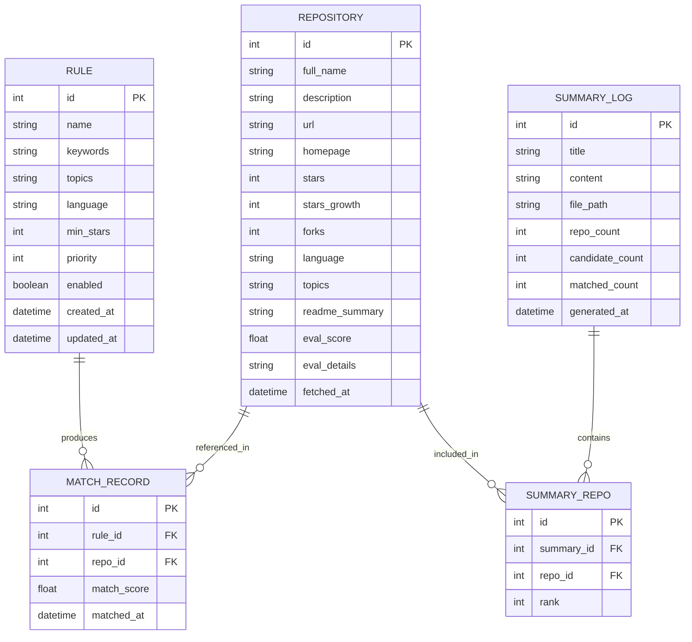
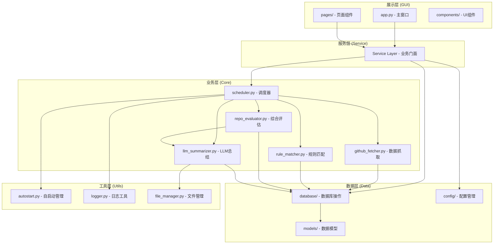
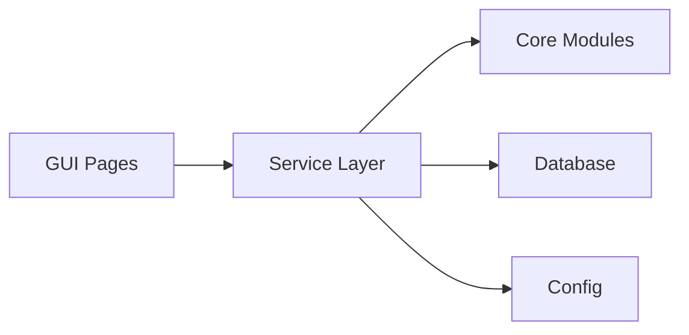

# GitHub热点推送 - 项目设计文档

## 1. 项目概述

### 1.1 项目名称

**GitHub热点推送**（GitHub Trending Pusher）

### 1.2 项目简介

GitHub热点推送是一个桌面端自动化工具，能够从GitHub上获取star增长较快且具有学习价值的开源项目，根据用户预设的推送规则进行智能筛选和综合评估，最终选取最优秀的N个项目（默认10个），通过大语言模型生成结构化的总结日志。项目提供简洁美观的图形化界面，方便用户管理推送规则、配置参数，并支持开机自启动。

### 1.3 项目目标与核心功能

| 功能模块         | 描述                                                       |
| ------------ | -------------------------------------------------------- |
| GitHub热门项目抓取 | 从GitHub获取star增长较快的热门开源项目，不限创建时间，关注增长趋势与质量                |
| 综合评估与筛选      | 结合规则匹配、star阈值、增长速度和LLM学习价值评估，综合评分后选取TOP N项目（默认10个，GUI可调） |
| LLM总结生成      | 通过大语言模型对筛选出的优质项目生成结构化总结（含仓库链接、介绍、应用举例）                   |
| 总结日志保存       | 将生成的总结日志保存到用户指定的本地路径                                     |
| GUI管理界面      | 提供美观的图形界面，用于规则管理、参数配置、推送数量设置、历史查看                        |
| 开机自启动        | 支持在GUI中切换是否开机自动启动                                        |

### 1.4 目标用户群体

- 编程开发人员：关注特定技术领域的开源项目动态
- 技术管理者：追踪团队技术栈相关的前沿项目
- 开源爱好者：发现优质开源项目和贡献机会
- 技术学习者：按兴趣方向获取学习资源

### 1.5 项目背景与价值

GitHub是全球最大的开源代码托管平台，每天有大量优质项目涌现。然而，手动从海量仓库中发现符合自身需求且具有学习价值的热门项目耗时费力。本项目通过**自动化抓取 + 智能规则匹配 + 综合评估筛选 + LLM总结**的方式，从增长较快的项目中精选出最优质的N个，帮助用户高效获取个性化的GitHub热门项目推送，降低信息筛选成本。

***

## 2. 技术栈

### 2.1 语言与运行时

| 类别   | 选型     | 版本要求  | 说明                |
| ---- | ------ | ----- | ----------------- |
| 编程语言 | Python | 3.10+ | 生态丰富，开发效率高，支持类型注解 |

### 2.2 GUI框架

| 类别    | 选型            | 版本    | 说明                                |
| ----- | ------------- | ----- | --------------------------------- |
| GUI框架 | CustomTkinter | 5.2+  | 基于tkinter的现代UI框架，原生支持深色/浅色主题，轻量美观 |
| 图标库   | Pillow        | 10.0+ | 图标和图片处理                           |

**CustomTkinter选型理由**：

- 相比原生tkinter：提供现代化圆角组件、自动深色模式、更美观的默认样式
- 相比PyQt5/6：无需额外安装Qt运行时，pip一键安装，体积更小
- 相比Web方案（Electron/Flask+浏览器）：无需浏览器依赖，打包体积小，原生桌面体验

### 2.3 核心依赖

| 类别         | 选型             | 版本    | 说明                                                      |
| ---------- | -------------- | ----- | ------------------------------------------------------- |
| GitHub API | PyGitHub       | 2.1+  | GitHub REST API的Python封装，用于搜索仓库、获取仓库详情和README内容等标准API调用 |
| HTTP请求     | httpx          | 0.25+ | 用于GitHub Trending页面抓取（无官方API的页面解析）和LLM API调用            |
| HTML解析     | BeautifulSoup4 | 4.12+ | 解析GitHub Trending页面HTML，提取趋势项目信息                        |
| LLM集成      | openai         | 1.0+  | 通过OpenAI兼容协议调用多家代理厂家的LLM API                             |
| 定时任务       | APScheduler    | 3.10+ | 轻量级Python定时任务调度框架                                       |
| 数据存储       | SQLite         | 内置    | 结构化数据存储（历史记录、规则）                                        |
| 配置管理       | pydantic       | 2.0+  | 配置模型校验和序列化                                              |

### 2.4 辅助依赖

| 类别   | 选型          | 版本   | 说明                     |
| ---- | ----------- | ---- | ---------------------- |
| 日志   | loguru      | 0.7+ | 美观易用的日志库               |
| 开机自启 | pywin32     | 306+ | Windows注册表操作，实现开机自启动管理 |
| 打包   | PyInstaller | 6.0+ | 将项目打包为Windows可执行文件     |
| 数据处理 | orjson      | 3.9+ | 高性能JSON序列化/反序列化        |

### 2.5 第三方服务

| 服务               | 提供方    | 用途                     |
| ---------------- | ------ | ---------------------- |
| GitHub REST API  | GitHub | 搜索和获取仓库信息              |
| GitHub Trending  | GitHub | 获取热门趋势项目               |
| OpenAI兼容LLM API | 多家代理厂家 | 提供大模型API服务（火山方舟、DeepSeek、智谱AI等） |

### 2.6 开发工具

| 工具         | 用途        |
| ---------- | --------- |
| Git        | 版本控制      |
| Trae IDE   | AI辅助开发    |
| pip + venv | 依赖管理与虚拟环境 |

***

## 3. 数据库设计

本项目采用**SQLite**作为本地结构化数据存储引擎，配合**JSON文件**存储应用配置。SQLite轻量、零配置、单文件存储，非常适合桌面应用场景。

### 3.1 ER关系图



### 3.2 数据表结构定义

#### 3.2.1 规则表（rules）

| 字段名         | 类型      | 约束                        | 说明                                                                                                                  |
| ----------- | ------- | ------------------------- | ------------------------------------------------------------------------------------------------------------------- |
| id          | INTEGER | PRIMARY KEY AUTOINCREMENT | 主键                                                                                                                  |
| name        | TEXT    | NOT NULL, UNIQUE          | 规则名称                                                                                                                |
| keywords    | TEXT    | NOT NULL                  | 关键词列表，JSON数组格式，如 `["AI","LLM","agent"]`                                                                             |
| topics      | TEXT    | DEFAULT '\[]'             | GitHub主题标签，JSON数组格式，如 `["machine-learning","nlp"]`                                                                  |
| language    | TEXT    | DEFAULT ''                | 编程语言筛选，如 `Python`，空字符串表示不限                                                                                          |
| min\_stars  | INTEGER | DEFAULT 0                 | 最低star数筛选（规则级别，0表示使用全局配置值github.min\_stars；非0时与全局配置取较大值作为有效阈值，即有效阈值=max(全局min\_stars, 规则级min\_stars)，规则级阈值只能比全局更严格） |
| priority    | INTEGER | DEFAULT 5                 | 优先级权重（1-10，10最高）                                                                                                    |
| enabled     | INTEGER | DEFAULT 1                 | 是否启用（0=禁用，1=启用）                                                                                                     |
| created\_at | TEXT    | NOT NULL                  | 创建时间，ISO 8601格式                                                                                                     |
| updated\_at | TEXT    | NOT NULL                  | 更新时间，ISO 8601格式                                                                                                     |

#### 3.2.2 仓库表（repositories）

| 字段名             | 类型      | 约束                        | 说明                                                                                |
| --------------- | ------- | ------------------------- | --------------------------------------------------------------------------------- |
| id              | INTEGER | PRIMARY KEY AUTOINCREMENT | 主键                                                                                |
| full\_name      | TEXT    | NOT NULL, UNIQUE          | 仓库全名（owner/repo）                                                                  |
| description     | TEXT    | DEFAULT ''                | 仓库描述                                                                              |
| url             | TEXT    | NOT NULL                  | 仓库URL                                                                             |
| homepage        | TEXT    | DEFAULT ''                | 项目主页                                                                              |
| stars           | INTEGER | DEFAULT 0                 | 当前star总数                                                                          |
| stars\_growth   | INTEGER | DEFAULT 0                 | star增长数（统计周期由配置github.growth\_period决定：daily/weekly/monthly；同一仓库不同周期抓取的增长数不可直接比较） |
| forks           | INTEGER | DEFAULT 0                 | fork数量                                                                            |
| language        | TEXT    | DEFAULT ''                | 主要编程语言                                                                            |
| topics          | TEXT    | DEFAULT '\[]'             | 仓库标签，JSON数组                                                                       |
| readme\_summary | TEXT    | DEFAULT ''                | 项目简介（LLM在学习价值评估阶段生成，来源于评估返回的summary字段，为1-2句话的项目功能概述）                              |
| eval\_score     | REAL    | DEFAULT 0.0               | 综合评估得分（0.0-100.0），由规则匹配度、star阈值、增长速度、学习价值综合计算                                     |
| eval\_details   | TEXT    | DEFAULT '{}'              | 评估详情，JSON格式，包含各维度得分明细（结构定义见下方）                                                    |
| fetched\_at     | TEXT    | NOT NULL                  | 抓取时间                                                                              |

**eval\_details JSON结构定义**：

```json
{
  "rule_match_score": 85.0,
  "star_threshold_score": 75.0,
  "growth_speed_score": 90.0,
  "learning_value_score": 77.5,
  "initial_score": 83.6,
  "final_score": 81.8,
  "matched_rules": [
    {"id": 1, "name": "AI大模型技能", "base_match_ratio": 0.85, "priority_bonus": 1.1}
  ],
  "effective_min_stars": 100,
  "learning_value_detail": {
    "innovation": 8.5,
    "code_quality": 7.0,
    "practicality": 9.0,
    "community": 6.5,
    "brief_reason": "项目采用创新架构，实用性强"
  },
  "growth_source": "trending",
  "parse_error": null
}
```

| 字段                      | 类型             | 说明                                                     |
| ----------------------- | -------------- | ------------------------------------------------------ |
| rule\_match\_score      | float          | 规则匹配度得分（0-100）                                         |
| star\_threshold\_score  | float          | Star阈值达标度得分（0-100）                                     |
| growth\_speed\_score    | float          | 增长速度得分（0-100）                                          |
| learning\_value\_score  | float          | 学习价值得分（0-100）                                          |
| initial\_score          | float          | 阶段一初始得分（三维度加权）                                         |
| final\_score            | float          | 阶段二最终得分（四维度加权），与eval\_score字段值相同                       |
| matched\_rules          | array          | 匹配的规则列表，含规则ID、名称、基础匹配比例、优先级加成系数                        |
| effective\_min\_stars   | int            | 该仓库的有效Star阈值（max(全局, 规则级)）                             |
| learning\_value\_detail | object         | LLM学习价值评估详情，含四维度评分和brief\_reason                       |
| growth\_source          | string         | 增长数据来源：trending（正常）/ fallback（Search API降级，无增长数据）      |
| parse\_error            | string \| null | LLM输出解析错误信息，正常时为null；JSON解析失败时记录错误原因（如"JSON解析失败：格式不符"） |

> **注意**：LLM评估返回的`summary`字段（项目功能概述）存储在repositories表的`readme_summary`字段中，不包含在eval\_details内。

#### 3.2.3 匹配记录表（match\_records）

| 字段名          | 类型      | 约束                                                                  | 说明                                                                                                                                                       |
| ------------ | ------- | ------------------------------------------------------------------- | -------------------------------------------------------------------------------------------------------------------------------------------------------- |
| id           | INTEGER | PRIMARY KEY AUTOINCREMENT                                           | 主键                                                                                                                                                       |
| rule\_id     | INTEGER | NOT NULL, FOREIGN KEY REFERENCES rules(id) ON DELETE CASCADE        | 关联规则ID，规则删除时级联删除匹配记录                                                                                                                                     |
| repo\_id     | INTEGER | NOT NULL, FOREIGN KEY REFERENCES repositories(id) ON DELETE CASCADE | 关联仓库ID，仓库删除时级联删除匹配记录                                                                                                                                     |
| match\_score | REAL    | NOT NULL                                                            | 匹配得分（0.0-1.0），为基础匹配比例（keyword\_match\_ratio × 0.5 + topic\_match\_ratio × 0.3 + language\_match × 0.2），不含优先级加成；5.5.2中的规则匹配度得分（0-100）= 此值 × 100 × 优先级加成系数 |
| matched\_at  | TEXT    | NOT NULL                                                            | 匹配时间                                                                                                                                                     |

#### 3.2.4 总结日志表（summary\_logs）

| 字段名              | 类型      | 约束                        | 说明                        |
| ---------------- | ------- | ------------------------- | ------------------------- |
| id               | INTEGER | PRIMARY KEY AUTOINCREMENT | 主键                        |
| title            | TEXT    | NOT NULL                  | 日志标题                      |
| content          | TEXT    | NOT NULL                  | 日志全文内容（Markdown格式）        |
| file\_path       | TEXT    | NOT NULL                  | 本地保存路径                    |
| repo\_count      | INTEGER | DEFAULT 0                 | 包含的推荐仓库数                  |
| candidate\_count | INTEGER | DEFAULT 0                 | 候选项目数（步骤1合并去重后的仓库总数）      |
| matched\_count   | INTEGER | DEFAULT 0                 | 匹配仓库数（步骤2规则匹配过滤后未被过滤的仓库数） |
| generated\_at    | TEXT    | NOT NULL                  | 生成时间                      |

#### 3.2.5 日志-仓库关联表（summary\_repos）

| 字段名         | 类型      | 约束                                                                   | 说明                     |
| ----------- | ------- | -------------------------------------------------------------------- | ---------------------- |
| id          | INTEGER | PRIMARY KEY AUTOINCREMENT                                            | 主键                     |
| summary\_id | INTEGER | NOT NULL, FOREIGN KEY REFERENCES summary\_logs(id) ON DELETE CASCADE | 关联总结日志ID，日志删除时级联删除关联记录 |
| repo\_id    | INTEGER | NOT NULL, FOREIGN KEY REFERENCES repositories(id) ON DELETE RESTRICT | 关联仓库ID，仓库被日志引用时禁止删除    |
| rank        | INTEGER | DEFAULT 0                                                            | 仓库在日志中的排名              |

### 3.3 JSON配置结构

应用配置存储在 `config/app_config.json` 中：

```json
{
  "github": {
    "token": "",
    "fetch_interval_hours": 24,
    "max_repos_per_fetch": 50,
    "trending_languages": ["python", "javascript", "typescript", "go", "rust"],
    "min_stars": 100,
    "growth_period": "daily"
  },
  "llm": {
    "provider": "volcengine_coding",
    "base_url": "https://ark.cn-beijing.volces.com/api/v3",
    "api_key": "",
    "model": "GLM-4.7",
    "temperature": 0.7,
    "max_tokens": 4096,
    "providers": {
      "openai": {"name": "OpenAI", "base_url": "https://api.openai.com/v1", "plans": [{"name": "按量计费", "model": "gpt-4o-mini"}]},
      "volcengine_coding": {"name": "火山方舟 Coding Plan", "base_url": "https://ark.cn-beijing.volces.com/api/v3", "plans": [{"name": "Coding Plan", "model": "GLM-4.7"}]},
      "volcengine": {"name": "火山方舟 按量计费", "base_url": "https://ark.cn-beijing.volces.com/api/v3", "plans": [{"name": "按量计费", "model": ""}]},
      "deepseek": {"name": "DeepSeek", "base_url": "https://api.deepseek.com/v1", "plans": [{"name": "按量计费", "model": "deepseek-chat"}]},
      "zhipuai": {"name": "智谱AI", "base_url": "https://open.bigmodel.cn/api/paas/v4", "plans": [{"name": "按量计费", "model": "glm-4-flash"}]},
      "moonshot": {"name": "月之暗面", "base_url": "https://api.moonshot.cn/v1", "plans": [{"name": "按量计费", "model": "moonshot-v1-8k"}]},
      "siliconflow": {"name": "硅基流动", "base_url": "https://api.siliconflow.cn/v1", "plans": [{"name": "按量计费", "model": "deepseek-ai/DeepSeek-V3"}]},
      "dashscope": {"name": "阿里云百炼", "base_url": "https://dashscope.aliyuncs.com/compatible-mode/v1", "plans": [{"name": "按量计费", "model": "qwen-plus"}]},
      "custom": {"name": "自定义", "base_url": "", "plans": []}
    }
  },
  "evaluation": {
    "top_n": 10,
    "weights": {
      "rule_match": 0.3,
      "star_threshold": 0.2,
      "growth_speed": 0.2,
      "learning_value": 0.3
    }
  },
  "output": {
    "save_dir": "",
    "format": "markdown",
    "filename_template": "github_trending_{date}.md"
  },
  "scheduler": {
    "enabled": true,
    "run_time": "09:00",
    "timezone": "Asia/Shanghai"
  },
  "autostart": {
    "enabled": false
  },
  "app": {
    "theme": "system",
    "language": "zh_CN",
    "minimize_to_tray": true
  }
}
```

> **默认值说明**：`output.save_dir`为空字符串时，默认保存到项目根目录下的`output/`文件夹（即`{APP_DATA_DIR}/output/`），首次运行时自动创建。

### 3.4 索引设计

| 表名             | 索引字段                  | 索引类型   | 说明                     |
| -------------- | --------------------- | ------ | ---------------------- |
| rules          | name                  | UNIQUE | 规则名称唯一索引，避免重复          |
| rules          | enabled               | NORMAL | 按启用状态查询规则              |
| repositories   | full\_name            | UNIQUE | 仓库全名唯一索引，避免重复插入        |
| repositories   | fetched\_at           | NORMAL | 按时间查询抓取记录              |
| repositories   | stars\_growth         | NORMAL | 按star增长数排序             |
| repositories   | eval\_score           | NORMAL | 按综合评估得分排序（TOP N查询核心索引） |
| match\_records | rule\_id              | NORMAL | 按规则查询匹配记录              |
| match\_records | repo\_id              | NORMAL | 按仓库查询匹配记录              |
| match\_records | rule\_id, repo\_id    | UNIQUE | 联合唯一索引，防止同一规则对同一仓库重复匹配 |
| summary\_repos | summary\_id           | NORMAL | 按日志查询关联仓库              |
| summary\_repos | repo\_id              | NORMAL | 按仓库查询关联日志              |
| summary\_repos | summary\_id, repo\_id | UNIQUE | 联合唯一索引，防止同一日志中重复关联仓库   |
| summary\_logs  | generated\_at         | NORMAL | 按时间查询日志                |

### 3.5 数据迁移策略

- 数据库文件存储路径：`{APP_DATA_DIR}/data/github_pusher.db`，首次启动时自动创建
- 使用SQLite内置的 `user_version` pragma 进行版本管理
- 每次数据库结构变更时，编写对应的迁移脚本
- 迁移脚本存放在 `Code/migrations/` 目录下
- 启动时自动检测数据库版本并执行必要的迁移
- **迁移失败处理**：迁移执行前自动备份数据库文件（备份路径：`{APP_DATA_DIR}/data/github_pusher.db.bak`），迁移失败时回滚至备份版本并在日志中记录错误，阻止应用启动并提示用户手动修复

### 3.6 数据写入策略

- **repositories表**：采用 `INSERT ... ON CONFLICT(full_name) DO UPDATE` 策略（SQLite UPSERT语法），同一仓库（按 `full_name` 判断）重复抓取时更新 `stars`、`stars_growth`、`eval_score`、`eval_details`、`readme_summary`、`fetched_at` 等可变字段，保留原 `id` 不变（注意：不可使用 `INSERT OR REPLACE`，该语句在唯一约束冲突时会删除旧行再插入新行，导致 `id` 变化从而破坏外键引用）
- **match\_records表**：每次评估任务执行前（即规则匹配步骤开始前）清空历史匹配记录，重新计算写入（匹配记录为过程数据，无需历史保留）
- **summary\_logs / summary\_repos表**：仅追加，不更新历史日志

***

## 4. 后端接口设计

### 4.1 GitHub API 接口

#### 4.1.1 GitHub Search API

用于按条件搜索仓库，获取热门项目列表。

| 接口   | 方法  | URL                                          | 说明               |
| ---- | --- | -------------------------------------------- | ---------------- |
| 搜索仓库 | GET | `https://api.github.com/search/repositories` | 按stars、创建时间等条件搜索 |

**请求参数**：

| 参数        | 类型     | 必填 | 说明                       |
| --------- | ------ | -- | ------------------------ |
| q         | string | 是  | 搜索查询语句                   |
| sort      | string | 否  | 排序字段：stars/forks/updated |
| order     | string | 否  | 排序方向：desc/asc            |
| per\_page | int    | 否  | 每页数量（默认30，最大100）         |
| page      | int    | 否  | 页码                       |

**搜索查询构造示例**：

```
# 获取star增长较快的Python项目（不限创建时间，关注增长趋势）
q=language:Python stars:>100
sort=stars

# 获取特定主题的高star项目
q=topic:machine-learning stars:>100
sort=stars

# 获取近期活跃的高star项目（pushed日期应动态计算，如当前日期-7天）
q=stars:>500 pushed:>2026-04-22
sort=stars
```

> **注意**：`sort`、`order`、`per_page`、`page` 为独立的URL查询参数，不属于 `q` 查询语句。`pushed:` 限定符中的日期应在代码中动态计算（如 `datetime.now() - timedelta(days=7).strftime('%Y-%m-%d')`），而非硬编码。

**响应数据结构**：

```json
{
  "total_count": 1234,
  "items": [
    {
      "full_name": "owner/repo",
      "description": "项目描述",
      "html_url": "https://github.com/owner/repo",
      "homepage": "https://example.com",
      "stargazers_count": 1500,
      "forks_count": 200,
      "language": "Python",
      "topics": ["ai", "llm"],
      "created_at": "2026-04-28T10:00:00Z",
      "updated_at": "2026-04-29T08:00:00Z"
    }
  ]
}
```

#### 4.1.2 GitHub Trending 抓取

GitHub Trending页面无官方API，需通过HTTP抓取解析。

| 接口     | 方法  | URL                                         | 说明     |
| ------ | --- | ------------------------------------------- | ------ |
| 趋势项目   | GET | `https://github.com/trending`               | 全语言趋势  |
| 特定语言趋势 | GET | `https://github.com/trending/{language}`    | 指定语言趋势 |
| 周趋势    | GET | `https://github.com/trending?since=weekly`  | 周趋势    |
| 月趋势    | GET | `https://github.com/trending?since=monthly` | 月趋势    |

#### 4.1.3 GitHub Rate Limit

| 认证方式    | 请求限制     | 说明                        |
| ------- | -------- | ------------------------- |
| 未认证     | 60次/小时   | 仅适合测试，不推荐生产使用             |
| Token认证 | 5000次/小时 | 推荐使用Personal Access Token |

#### 4.1.4 GitHub账号所需信息与权限说明

本项目需要用户提供GitHub Personal Access Token（PAT）以访问GitHub API。以下为所需权限的详细说明：

**必须提供的权限**：

| 权限范围   | 权限标识          | 说明                     | 必要性    |
| ------ | ------------- | ---------------------- | ------ |
| 公共仓库只读 | `public_repo` | 访问公共仓库信息（搜索、读取README等） | **必须** |

**不需要的权限**：

| 权限范围          | 说明            | 原因                    |
| ------------- | ------------- | --------------------- |
| `repo`（完整）    | 完整仓库访问（含私有仓库） | 本项目仅关注公共开源项目，无需访问私有仓库 |
| `user`        | 用户个人信息        | 本项目不涉及用户身份操作          |
| `admin:org`   | 组织管理          | 本项目不需要组织级操作           |
| `delete_repo` | 删除仓库          | 本项目不执行任何写操作           |

**用户需要提供的信息清单**：

| 信息项                          | 格式                 | 说明                                                                |
| ---------------------------- | ------------------ | ----------------------------------------------------------------- |
| GitHub Personal Access Token | `ghp_xxxxxxxxxxxx` | 在GitHub Settings → Developer settings → Personal access tokens中生成 |
| Token权限                      | 仅需 `public_repo`   | 最小权限原则，保障账号安全                                                     |

**安全提示**：

- PAT仅用于调用GitHub REST API，**不会执行任何写操作**（如star、fork、评论等）
- PAT存储在本地配置文件中，不会上传至任何服务器
- 建议定期更换PAT，避免长期使用同一令牌
- 如发现Token泄露，应立即在GitHub上撤销

### 4.2 LLM API 接口

本项目通过**OpenAI兼容协议**调用多家代理厂家的大模型API，支持用户自由选择代理厂家、API Key和模型。

#### 4.2.1 预设代理厂家

| 厂家标识           | 厂家名称            | Base URL                                          | 预设套餐                           |
| ---------------- | --------------- | ------------------------------------------------- | ------------------------------ |
| openai          | OpenAI          | `https://api.openai.com/v1`                       | 按量计费 (gpt-4o-mini)            |
| volcengine_coding | 火山方舟 Coding Plan | `https://ark.cn-beijing.volces.com/api/v3`        | Coding Plan (GLM-4.7)          |
| volcengine      | 火山方舟 按量计费       | `https://ark.cn-beijing.volces.com/api/v3`        | 按量计费 (需Endpoint ID)            |
| deepseek        | DeepSeek        | `https://api.deepseek.com/v1`                     | 按量计费 (deepseek-chat)           |
| zhipuai         | 智谱AI            | `https://open.bigmodel.cn/api/paas/v4`            | 按量计费 (glm-4-flash)             |
| moonshot        | 月之暗面            | `https://api.moonshot.cn/v1`                      | 按量计费 (moonshot-v1-8k)          |
| siliconflow     | 硅基流动            | `https://api.siliconflow.cn/v1`                   | 按量计费 (deepseek-ai/DeepSeek-V3) |
| dashscope       | 阿里云百炼           | `https://dashscope.aliyuncs.com/compatible-mode/v1` | 按量计费 (qwen-plus)               |
| custom          | 自定义             | 用户自行填写                                            | -                              |

> **注意**：用户可在GUI设置页面选择代理厂家后，点击"获取模型"按钮自动从厂家API获取可用模型列表，也可在"自定义模型"输入框中手动输入模型名称。

#### 4.2.2 接口配置

| 配置项      | 值                                          | 说明                   |
| -------- | ------------------------------------------ | -------------------- |
| provider | `volcengine`                               | 当前选中的代理厂家标识           |
| Base URL | `https://ark.cn-beijing.volces.com/api/v3` | 当前厂家的OpenAI兼容接口地址     |
| API Key  | `sk-sp-xxx`                                | 对应厂家的API Key          |
| 模型标识     | `GLM-4.7`                                  | 可通过API获取或自定义输入        |

#### 4.2.3 Chat Completions 接口

| 接口   | 方法   | URL                           | 说明          |
| ---- | ---- | ----------------------------- | ----------- |
| 对话补全 | POST | `{base_url}/chat/completions` | 学习价值评估与总结生成 |

**请求参数**：

```json
{
  "model": "GLM-4.7",
  "messages": [
    {
      "role": "system",
      "content": "你是一个专业的开源项目分析师。请对提供的GitHub仓库进行学习价值评估。从以下四个维度打分（每项0-10分，保留一位小数）：技术创新性、代码质量、实用性、社区活跃度。同时为每个项目提供1-2句话的功能概述。请严格按照JSON格式返回评估结果，不要输出其他内容。"
    },
    {
      "role": "user",
      "content": "请评估以下GitHub项目的学习价值：\n仓库：owner/repo\n描述：xxx\nStars：1500\nForks：200\n标签：ai, llm\n语言：Python\nREADME内容（截取）：xxx"
    }
  ],
  "temperature": 0.3,
  "max_tokens": 2048,
  "stream": false
```

> **注意**：学习价值评估和总结生成使用不同的`max_tokens`和`temperature`：学习价值评估固定使用2048（返回紧凑的JSON评分结果）和temperature=0.3（确保评分稳定性），总结生成使用配置文件中的`llm.max_tokens`（默认4096，用于生成较长的Markdown报告）和`llm.temperature`（默认0.7，允许更灵活的文本生成）。上述请求示例展示的是学习价值评估的参数，总结生成时需将temperature和max\_tokens替换为对应配置值。

**响应数据结构**：

```json
{
  "id": "chatcmpl-xxx",
  "choices": [
    {
      "message": {
        "role": "assistant",
        "content": "[{\"repo\":\"owner/repo\",\"summary\":\"一个基于LLM的智能Agent框架\",\"scores\":{\"innovation\":8.5,\"code_quality\":7.0,\"practicality\":9.0,\"community\":6.5},\"average_score\":7.8,\"brief_reason\":\"项目采用创新架构，实用性强\"}]"
      },
      "finish_reason": "stop"
    }
  ],
  "usage": {
    "prompt_tokens": 500,
    "completion_tokens": 200,
    "total_tokens": 700
  }
}
```

#### 4.2.3 LLM调用说明

本项目对LLM有**两次独立调用**，分别用于学习价值评估和总结生成：

| 调用阶段   | 调用方                           | 目的        | 输入                | 输出                                                                    |
| ------ | ----------------------------- | --------- | ----------------- | --------------------------------------------------------------------- |
| 学习价值评估 | RepoEvaluator → LLMSummarizer | 评估项目学习价值  | TOP N项目信息         | 四维度评分（0-10）+ 项目简介（summary）+ 综合均分（average\_score）+ 价值概述（brief\_reason） |
| 总结生成   | Scheduler → LLMSummarizer     | 生成结构化总结报告 | 最终排名的TOP N项目及评估结果 | Markdown格式总结                                                          |

**LLM输出容错处理**：

由于LLM输出存在不确定性，需对返回内容进行容错解析：

| 场景                 | 处理策略                                                                                            |
| ------------------ | ----------------------------------------------------------------------------------------------- |
| JSON被markdown代码块包裹 | 使用正则提取 \`\`\`json ... \`\`\` 中的内容后再解析JSON                                                       |
| JSON解析失败           | 重试一次（同一请求重新调用LLM）；仍失败则该仓库学习价值得分设为50（中性分），并在eval\_details中标记解析失败原因                               |
| 评分超出0-10范围         | 截断到有效范围（<0设为0，>10设为10）                                                                          |
| 缺少必要字段             | 缺少的维度得分用5.0（中性分）填充，brief\_reason用"评估信息不完整"填充，summary用仓库description填充（若description也为空则用"暂无简介"填充） |
| 总结生成格式偏差           | 直接使用LLM返回的原始文本，不做强制格式校验（总结为自由文本，不影响后续流程）                                                        |
| LLM返回空内容           | 学习价值评估：该仓库得分设为50；总结生成：使用预设模板生成基础报告，标注"LLM生成失败"                                                  |

#### 4.2.4 学习价值评估Prompt模板

系统提示词（System Prompt）：

````
你是一个专业的开源项目分析师。请对提供的GitHub仓库进行学习价值评估。

从以下四个维度打分（每项0-10分，保留一位小数）：
- 技术创新性：项目是否采用了新技术、新架构或创新思路
- 代码质量：项目代码结构、文档完整性、测试覆盖等
- 实用性：项目在实际开发中的应用价值和学习参考价值
- 社区活跃度：Issue处理速度、PR合并频率、贡献者数量

同时为每个项目提供1-2句话的功能概述（summary）。

请严格按以下JSON格式返回评估结果，不要输出其他内容。
```json
[
  {{
    "repo": "owner/repo",
    "summary": "1-2句话描述项目的主要功能和用途",
    "scores": {{
      "innovation": 8.5,
      "code_quality": 7.0,
      "practicality": 9.0,
      "community": 6.5
    }},
    "average_score": 7.8,
    "brief_reason": "1-2句话概括学习价值"
  }}
]
```
````

用户提示词模板：

```
请评估以下GitHub项目的学习价值：

{repos_content}

请严格按系统提示中定义的JSON格式返回评估结果，不要输出其他内容。
```

> **占位符说明**：`{repos_content}`替换为待评估项目信息的文本，每个项目格式如下：
>
> ```
> 仓库：owner/repo
> 描述：项目描述
> Stars：1500
> Forks：200
> 标签：ai, llm
> 语言：Python
> README内容（截取）：前4000字符...
> ---
> ```
>
> 多个项目之间用`---`分隔。

> **注意**：学习价值评估使用较低的temperature（建议0.3），确保评分稳定性和输出格式的可靠性。README内容截取前**4000个字符**（约1000-1500个token），超出部分截断并附加"…（内容已截断）"，以控制LLM输入token数。当TOP N项目数量较多时（如超过5个），分批调用LLM评估，每批最多**5个项目**；当前使用同步httpx+后台线程模式，批次间顺序执行，未来可升级为异步并发处理。

#### 4.2.5 总结生成Prompt模板

系统提示词（System Prompt）：

```
你是一个专业的开源项目分析师。请根据提供的GitHub仓库信息和评估结果，生成结构化的总结报告。

报告要求：

- 为每个项目生成结构化总结，包含：仓库链接、项目介绍（2-3句话）、学习价值说明（1-2句话）、实际应用举例（2-3个场景）
- 语言简洁专业，突出项目亮点和实用价值
- 如果多个项目属于同一领域，可以在末尾添加领域趋势分析
```

用户提示词模板：

````
请为以下{count}个GitHub热门项目生成总结报告：

{repos\_content\_with\_eval}

请按照以下格式生成总结报告：
```

# GitHub热点推送 - {date}

## 推荐项目

### 1. {{repo\_name}}

- **仓库链接**：{{repo\_url}}
- **综合评分**：{{eval\_score}}/100
- **项目介绍**：{{description}}
- **学习价值说明**：{{learning\_value}}
- **实际应用举例**：
  1. {{use\_case\_1}}
  2. {{use\_case\_2}}

...

## 趋势总结

{{trend\_summary}}

```

> **占位符说明**：`{repos_content_with_eval}`替换为最终排名项目信息及评估结果的文本，`{count}`替换为项目数量，`{date}`替换为当前日期。双花括号标记（如`{{repo_name}}`、`{{repo_url}}`等）为示例输出格式标记，不是模板占位符，在Python format string中会渲染为单花括号。每个项目格式如下：
> ```
> 仓库：owner/repo
> 描述：项目描述
> Stars：1500 | Forks：200 | 语言：Python
> 标签：ai, llm
> 综合评分：92/100
> 评估详情：技术创新性8.5, 代码质量7.0, 实用性9.0, 社区活跃度6.5
> 学习价值：项目采用创新架构，实用性强
> ---
> ```
> 多个项目之间用`---`分隔。

### 4.3 内部模块间接口

#### 4.3.1 模块调用关系

```mermaid
sequenceDiagram
    participant S as Scheduler
    participant F as GitHubFetcher
    participant M as RuleMatcher
    participant E as RepoEvaluator
    participant L as LLMSummarizer
    participant DB as Database
    participant FM as FileManager

    S->>F: fetch_trending_repos() 触发抓取任务
    F->>F: 调用GitHub API获取热门项目
    F-->>S: 返回Trending仓库列表
    S->>F: search_repos_by_query() 根据规则定向搜索
    F-->>S: 返回Search仓库列表
    S->>S: 合并去重Trending和Search结果
    S->>DB: 存储仓库数据

    S->>DB: 读取启用的规则
    S->>DB: 清空历史匹配记录（match\_records）
    S->>M: match_rules(repos, rules) 执行规则匹配
    M->>M: 计算规则匹配度得分，标记每个仓库匹配的规则
    M->>DB: 存储匹配记录
    M-->>S: 返回匹配结果

    S->>E: evaluate_repos(matched_repos, top_n) 综合评估
    E->>E: Star阈值过滤（全局+规则级min_stars）
    E->>E: 增长速度计算（growth_threshold基于过滤后有Trending数据的仓库）
    E->>E: 阶段一：初始评分（规则匹配度+Star达标度+增长速度）
    E->>E: 按初始得分排序，选取TOP N项目
    E->>L: evaluate_learning_value(top_repos) LLM学习价值评估
    L->>L: 调用GLM-4.7评估学习价值（temperature=0.3）
    L-->>E: 返回学习价值评分
    E->>E: 阶段二：最终评分（四维度加权，含学习价值）
    E->>DB: 存储最终评估得分
    E-->>S: 返回最终排名的TOP N项目

    S->>L: generate_summary(top_repos) 生成总结报告
    L->>L: 调用GLM-4.7生成结构化总结（temperature=0.7）
    L->>FM: save_summary(content, path) 保存日志文件
    L->>DB: 存储日志记录
    L-->>S: 任务完成通知
````

#### 4.3.2 模块接口定义

| 接口                                                                    | 提供方           | 调用方                               | 描述                                                                                                                                                                                                                                                                  |
| --------------------------------------------------------------------- | ------------- | --------------------------------- | ------------------------------------------------------------------------------------------------------------------------------------------------------------------------------------------------------------------------------------------------------------------- |
| `fetch_trending_repos(languages=None, since="daily")`                 | GitHubFetcher | Scheduler                         | 获取热门仓库列表，languages为关注的编程语言列表（来自配置github.trending\_languages，None时使用配置值），since为时间范围（daily/weekly/monthly，来自配置github.growth\_period）                                                                                                                                  |
| `search_repos_by_query(keywords, topics, language, min_stars)`        | GitHubFetcher | Scheduler                         | 按规则条件搜索仓库；GitHubFetcher内部调用私有方法\_build\_search\_query()构造GitHub Search API查询语句（keywords拼接为q参数搜索词、topics拼接为topic:限定符、language拼接为language:限定符、min\_stars拼接为stars:限定符），执行搜索并返回结果。Scheduler遍历所有启用规则，为每条规则提取keywords/topics/language和全局github.min\_stars调用此接口，多次调用结果合并去重 |
| `match_rules(repos, rules)`                                           | RuleMatcher   | Scheduler                         | 执行规则匹配                                                                                                                                                                                                                                                              |
| `evaluate_repos(matched_repos, top_n)`                                | RepoEvaluator | Scheduler                         | 综合评估仓库，返回TOP N项目                                                                                                                                                                                                                                                    |
| `get_eval_score(repo, rules)`                                         | RepoEvaluator | RepoEvaluator                     | 计算单个仓库综合评估得分                                                                                                                                                                                                                                                        |
| `evaluate_learning_value(repos)`                                      | LLMSummarizer | RepoEvaluator                     | 评估项目学习价值，返回四维度评分                                                                                                                                                                                                                                                    |
| `generate_summary(top_repos)`                                         | LLMSummarizer | Scheduler                         | 生成总结报告                                                                                                                                                                                                                                                              |
| `save_summary(content, path)`                                         | FileManager   | LLMSummarizer                     | 保存日志文件                                                                                                                                                                                                                                                              |
| `get_rules(enabled_only)`                                             | Database      | Scheduler/RuleMatcher/RuleService | 获取规则列表                                                                                                                                                                                                                                                              |
| `add_rule(rule_data)`                                                 | Database      | RuleService                       | 新增规则                                                                                                                                                                                                                                                                |
| `update_rule(rule_id, rule_data)`                                     | Database      | RuleService                       | 更新规则                                                                                                                                                                                                                                                                |
| `delete_rule(rule_id)`                                                | Database      | RuleService                       | 删除规则（级联删除关联的match\_records）                                                                                                                                                                                                                                         |
| `toggle_rule(rule_id, enabled)`                                       | Database      | RuleService                       | 启用/禁用规则                                                                                                                                                                                                                                                             |
| `upsert_repositories(repos)`                                          | Database      | Scheduler                         | 批量存储仓库数据（UPSERT，按full\_name去重更新）                                                                                                                                                                                                                                    |
| `clear_match_records()`                                               | Database      | Scheduler                         | 清空历史匹配记录（每次评估任务前调用）                                                                                                                                                                                                                                                 |
| `save_match_records(records)`                                         | Database      | RuleMatcher                       | 批量存储匹配记录                                                                                                                                                                                                                                                            |
| `update_repo_eval(repo_id, eval_score, eval_details, readme_summary)` | Database      | RepoEvaluator                     | 更新仓库评估得分、评估详情和项目简介                                                                                                                                                                                                                                                  |
| `save_summary_log(log_data, repo_ids)`                                | Database      | LLMSummarizer                     | 存储总结日志记录及日志-仓库关联记录                                                                                                                                                                                                                                                  |
| `set_autostart(enabled)`                                              | AutoStart     | SettingsService                   | 设置开机自启动                                                                                                                                                                                                                                                             |

### 4.4 错误码定义

| 错误码  | 名称                     | 说明                  |
| ---- | ---------------------- | ------------------- |
| 1001 | GITHUB\_API\_ERROR     | GitHub API调用失败      |
| 1002 | GITHUB\_RATE\_LIMIT    | GitHub API速率限制      |
| 1003 | GITHUB\_TOKEN\_INVALID | GitHub Token无效      |
| 2001 | LLM\_API\_ERROR        | LLM API调用失败         |
| 2002 | LLM\_TIMEOUT           | LLM响应超时             |
| 2003 | LLM\_API\_KEY\_INVALID | LLM API Key无效       |
| 3001 | DB\_ERROR              | 数据库操作失败             |
| 3501 | EVAL\_ERROR            | 综合评估计算失败            |
| 3502 | EVAL\_WEIGHT\_INVALID  | 评估权重配置无效（权重之和不为1.0） |
| 4001 | RULE\_INVALID          | 规则配置无效              |
| 4002 | RULE\_NOT\_FOUND       | 规则不存在               |
| 5001 | FILE\_SAVE\_ERROR      | 文件保存失败              |
| 5002 | DIR\_NOT\_FOUND        | 输出目录不存在             |
| 6001 | AUTOSTART\_ERROR       | 开机自启动设置失败           |

***

## 5. 后端实现规范

### 5.1 代码目录结构

```
Code/
├── main.py                      # 程序入口
├── config/
│   ├── __init__.py
│   ├── settings.py              # 全局配置管理（单例）
│   └── default_config.json      # 默认配置模板
├── core/
│   ├── __init__.py
│   ├── github_fetcher.py        # GitHub数据抓取器
│   ├── rule_matcher.py          # 规则匹配引擎
│   ├── repo_evaluator.py        # 仓库综合评估器
│   ├── llm_summarizer.py        # LLM总结生成器
│   └── scheduler.py             # 定时任务调度器
├── service/
│   ├── __init__.py
│   ├── dashboard_service.py     # 仪表盘服务
│   ├── rule_service.py          # 规则管理服务
│   ├── history_service.py       # 历史记录服务
│   ├── settings_service.py      # 设置管理服务
│   └── task_service.py          # 任务执行服务
├── gui/
│   ├── __init__.py
│   ├── app.py                   # 主窗口应用（含侧边栏全局操作：立即执行、开机自启）
│   ├── pages/
│   │   ├── __init__.py
│   │   ├── dashboard_page.py    # 仪表盘页面
│   │   ├── rules_page.py        # 规则管理页面
│   │   ├── settings_page.py     # 设置页面
│   │   └── history_page.py      # 历史记录页面
│   └── components/
│       ├── __init__.py
│       └── widgets.py           # 自定义公共组件
├── models/
│   ├── __init__.py
│   ├── repository.py            # 仓库数据模型
│   ├── rule.py                  # 规则数据模型
│   ├── evaluation.py            # 评估结果数据模型
│   └── summary.py               # 总结日志模型
├── database/
│   ├── __init__.py
│   ├── connection.py            # 数据库连接管理
│   ├── crud.py                  # 通用CRUD操作
│   └── migrations.py            # 数据库迁移管理
├── utils/
│   ├── __init__.py
│   ├── autostart.py             # 开机自启动管理
│   ├── logger.py                # 日志工具
│   ├── file_manager.py          # 文件管理工具
│   └── helpers.py               # 通用辅助函数
├── migrations/
│   └── v1_init.py               # 初始数据库迁移脚本
├── assets/
│   └── icon.ico                 # 应用图标
├── data/                        # 运行时数据（自动生成，.gitignore排除）
│   └── github_pusher.db         # SQLite数据库文件
├── logs/                        # 运行日志（自动生成，.gitignore排除）
├── requirements.txt             # Python依赖
└── pyproject.toml               # 项目元数据
```

### 5.2 分层架构设计



**分层原则**：

- **展示层**只负责UI渲染和用户交互，不包含业务逻辑，通过服务层间接调用业务层
- **服务层**作为业务门面（Facade），封装业务层接口，为展示层提供统一调用入口
- **业务层**负责核心业务处理，不直接操作数据库（通过数据层）
- **数据层**负责数据持久化和配置管理
- **工具层**提供通用辅助能力，被各层调用
- 严格遵循**单向依赖**：展示层 → 服务层 → 业务层 → 数据层，禁止反向依赖

### 5.3 命名规范

| 类别    | 规范                 | 示例                             |
| ----- | ------------------ | ------------------------------ |
| 模块名   | 全小写，下划线分隔          | `github_fetcher.py`            |
| 类名    | 大驼峰（PascalCase）    | `GitHubFetcher`, `RuleMatcher` |
| 函数名   | 小写下划线（snake\_case） | `fetch_trending_repos()`       |
| 常量名   | 全大写下划线             | `MAX_REPOS_PER_FETCH`          |
| 私有方法  | 前缀单下划线             | `_build_search_query()`        |
| 配置键   | 小写下划线              | `fetch_interval_hours`         |
| 数据库表名 | 复数小写下划线            | `match_records`                |
| 数据库字段 | 小写下划线              | `created_at`                   |

### 5.4 注释规范

本项目严格要求编写以下三类注释：

#### 5.4.1 类注释

```python
class GitHubFetcher:
    """GitHub热门项目数据抓取器。

    负责从GitHub Search API和Trending页面获取热门开源项目数据，
    支持按语言、主题、star数等多维度筛选，并自动处理API速率限制。

    Attributes:
        token: GitHub Personal Access Token，用于API认证。
        client: httpx同步客户端实例（耗时操作在后台线程中执行，无需异步）。
    """
```

#### 5.4.2 业务函数注释

```python
def fetch_trending_repos(self, languages: list[str] | None = None, since: str = "daily") -> list[dict]:
    """获取GitHub趋势项目列表。

    通过抓取GitHub Trending页面和调用Search API，获取指定时间段内
    star增长最快的项目列表。当Trending页面抓取失败时，自动降级为
    Search API查询。

    Args:
        languages: 编程语言筛选列表，None或空列表表示所有语言。
        since: 时间范围，可选 daily/weekly/monthly。

    Returns:
        包含仓库信息的字典列表，每个字典包含 full_name、description、
        url、homepage、stars、stars_growth、forks、language、topics、
        fetched_at 等字段。

    Raises:
        GitHubAPIError: 当API调用失败且降级方案也失败时抛出。
    """
```

#### 5.4.3 函数注释

```python
def _build_search_query(self, keywords: list[str], topics: list[str] | None = None, language: str = "") -> str:
    """构造GitHub Search API查询语句。"""
```

### 5.5 综合评估算法设计

项目选择标准调整为：**不限创建时间，只需满足增长较快且符合预设规则、star数量达到指定阈值、经过模型评估后具有学习价值的开源项目**。

#### 5.5.1 评估维度与权重

| 评估维度      | 权重  | 说明                         | 数据来源                    |
| --------- | --- | -------------------------- | ----------------------- |
| 规则匹配度     | 30% | 仓库信息与用户预设规则的匹配程度           | RuleMatcher计算           |
| Star阈值达标度 | 20% | star数是否达到预设阈值，超过阈值越多分越高    | GitHub API              |
| 增长速度      | 20% | star增长速度（可按日/周/月统计）        | GitHub Trending / API差值 |
| 学习价值      | 30% | LLM评估的技术创新性、代码质量、实用性、社区活跃度 | GLM-4.7评估               |

#### 5.5.2 综合评分公式

评估采用**两阶段评分**机制：初始评分（三维度）→ LLM评估后最终评分（四维度）。

**阶段一：初始评分（TOP N筛选前，不含学习价值）**

```
初始得分 = 规则匹配度得分 × W1 + Star阈值达标度得分 × W2 + 增长速度得分 × W3

其中权重在阶段一归一化：
W1 = weights.rule_match / (weights.rule_match + weights.star_threshold + weights.growth_speed)
W2 = weights.star_threshold / (weights.rule_match + weights.star_threshold + weights.growth_speed)
W3 = weights.growth_speed / (weights.rule_match + weights.star_threshold + weights.growth_speed)
```

**阶段二：最终评分（TOP N筛选后，含学习价值）**

```
最终得分 = 规则匹配度得分 × weights.rule_match
         + Star阈值达标度得分 × weights.star_threshold
         + 增长速度得分 × weights.growth_speed
         + 学习价值得分 × weights.learning_value
```

**各维度得分计算（统一归一化到0-100范围）**：

```
- 规则匹配度得分（0-100）= (keyword_match_ratio × 0.5 + topic_match_ratio × 0.3 + language_match × 0.2) × 100
  各子维度计算方式：
  - keyword_match_ratio（0-1）：规则关键词在仓库信息（full_name + description + topics文本）中出现的数量 / 规则关键词总数（不区分大小写，部分匹配即可，如关键词"AI"可匹配"AI-Agent"）
  - topic_match_ratio（0-1）：规则topics与仓库topics的交集数量 / 规则topics总数（精确匹配，不区分大小写）
  - language_match（0或1）：规则language非空时，与仓库language是否一致（不区分大小写）；规则language为空时取1（不限制）
  空条件处理：当规则的某筛选维度为空时，该维度不参与区分，对应子维度得分取1.0（满分）：
  - 规则keywords为空（空数组[]，keywords字段约束NOT NULL不会为NULL）：keyword_match_ratio = 1.0
  - 规则topics为空（默认[]）：topic_match_ratio = 1.0
  - 规则language为空（默认''）：language_match = 1.0
  当仓库匹配多条规则时，取最终规则匹配度得分（含优先级加成）最高的规则得分作为该仓库的规则匹配度得分
  即：最终规则匹配度得分 = min(基础匹配度得分 × (1 + (rule.priority - 5) × 0.02), 100)
  （priority=5时加成系数为1.0（无加成），priority=10时加成系数为1.1，priority=1时加成系数为0.92；最终得分上限100）
  当无任何启用规则时，所有仓库的规则匹配度得分默认为50（中性分，不加分不扣分）

- Star阈值达标度得分（0-100）= min_stars > 0 ? min(stars / min_stars, 2.0) / 2.0 × 100 : 100
  （min_stars为该仓库的有效阈值，取值方式：max(全局github.min_stars, 规则级min_stars)；若仓库匹配的规则设置了min_stars（非0），则与全局值取较大值作为有效阈值；若匹配多条规则且min_stars不同，取其中最大值（最严格阈值）参与max计算；超过2倍阈值即满分；当全局和规则级min_stars均为0时表示不设阈值，直接满分）

- 增长速度得分（0-100）= min(stars_growth / growth_threshold, 2.0) / 2.0 × 100
  （growth_threshold根据过滤后的仓库动态调整，超过2倍阈值即满分；此为相对评分，阈值取决于本次评估样本的整体增长水平）
  growth_threshold计算方式：取Star阈值过滤后有Trending数据的仓库stars_growth的中位数（median），若中位数为0则降级使用均值+1避免除零；若过滤后无Trending数据仓库则所有仓库增长速度得分设为50；若过滤后有Trending数据的仓库stars_growth全为0（中位数和均值均为0），则所有仓库增长速度得分设为50（中性分，与无Trending数据场景一致）
  **降级策略**：当Trending页面抓取失败、降级为Search API时，stars_growth数据不可用（Search API不提供增长数据）。此时增长速度得分统一设为50（中性分），并在eval_details中标记`"growth_source": "fallback"`；若本次抓取混合了Trending和Search API来源的仓库，则仅对有Trending数据的仓库计算增长速度得分，Search API来源的仓库增长速度得分设为50，growth_threshold仅基于有Trending数据的仓库计算

- 学习价值得分（0-100）= LLM评估四维度得分截断后重算的平均值 × 10
  （由GLM-4.7从技术创新性、代码质量、实用性、社区活跃度四维度评估，每项0-10分；若某维度评分超出0-10范围则截断到有效范围，然后取四维度截断后得分的算术平均值×10转为百分制；不直接使用LLM返回的average_score，以确保截断后得分一致性）
```

#### 5.5.3 评估流程

```
1. 数据抓取 → 获取候选仓库列表（Scheduler先调用GitHubFetcher.fetch_trending_repos()获取Trending项目；再根据启用的规则中的关键词、主题和语言，调用GitHubFetcher.search_repos_by_query()进行定向搜索，两部分结果按full\_name合并去重后作为候选仓库列表；若合并去重后候选仓库数超过配置github.max\_repos\_per\_fetch（默认50），则按stars降序截断至该上限）
2. 规则匹配 → 计算规则匹配度得分，标记每个仓库匹配的规则（含规则级min_stars信息）；过滤不匹配任何启用规则的仓库（**匹配判定标准**：仓库对某条规则的match_score > 0即视为匹配该规则；若仓库对所有启用规则的match_score均为0则不匹配任何规则，予以过滤）；若无启用规则则保留所有仓库
3. Star阈值过滤 → 根据步骤2中仓库匹配的规则，计算每个仓库的有效阈值（有效阈值=max(全局github.min_stars, 规则级min_stars)；若匹配多条规则且各规则的min_stars不同，取其中最大值参与max计算），剔除低于有效阈值的仓库
4. 增长速度计算 → 根据Trending数据计算增长速度得分（growth\_threshold基于步骤3过滤后的仓库中有Trending数据的仓库stars\_growth中位数计算；若过滤后无Trending数据仓库则所有仓库增长速度得分设为50）
5. 初始评分 → 基于规则匹配度、Star达标度、增长速度三维度计算初始得分
6. TOP N初筛 → 按初始得分降序排列，选取前N个项目进入LLM评估
7. LLM学习价值评估 → 对TOP N项目调用GLM-4.7进行学习价值评估
8. 最终评分 → 综合四维度（含学习价值）计算最终得分，确定最终排名
9. 生成报告 → 按最终排名生成总结日志
```

> **注意**：LLM学习价值评估仅在TOP N项目上执行，而非全量候选项目，以控制API调用成本。初始评分阶段不包含学习价值维度，权重自动归一化。任务执行过程中，每个步骤之间检查取消信号（`TaskService.cancel_task()`），若检测到取消则中断执行并回滚已写入的中间数据。**回滚范围**：清空本次写入的match\_records（按3.6策略下次任务执行前也会清空，此处为即时清理）；将本次更新的repositories记录的eval\_score、eval\_details、readme\_summary恢复为默认值（分别为0.0、空JSON对象{}、空字符串），避免未完成评估的残留数据影响后续展示；尚未写入的summary\_logs无需处理（仅任务完成后才写入）。

**边界情况处理**：

| 场景                                | 处理策略                                                                   |
| --------------------------------- | ---------------------------------------------------------------------- |
| 过滤后候选仓库为0                         | 跳过后续评估和LLM调用步骤，生成空报告（标题+无推荐项目提示），在日志中记录"本次抓取无符合条件的项目"                  |
| 候选仓库数量少于TOP N                     | 取全部候选仓库进入LLM评估，不强制凑满TOP N数量；日志中记录实际推荐项目数                               |
| 所有仓库增长数据不可用（Search API降级）         | 所有仓库增长速度得分设为50（中性分），growth\_source标记为fallback                          |
| LLM评估全部失败                         | 所有仓库学习价值得分设为50（中性分），仍按四维度最终得分排名生成报告（学习价值得分统一为50不影响相对排名），日志中标注"LLM评估失败" |
| 无启用规则                             | 保留所有仓库（不进行规则匹配过滤），规则匹配度得分默认50                                          |
| 过滤后有Trending数据的仓库stars\_growth全为0 | 所有仓库增长速度得分设为50（中性分），与无Trending数据场景一致                                   |

> **执行顺序说明**：步骤1中`fetch_trending_repos()`和`search_repos_by_query()`为**顺序执行**（先获取Trending项目，再根据规则定向搜索），由Scheduler协调合并去重后统一存储。当前设计不使用并行抓取，以简化错误处理和速率控制。

### 5.6 异常处理规范

```python
class AppError(Exception):
    """应用基础异常类。"""
    def __init__(self, code: int, message: str):
        self.code = code
        self.message = message
        super().__init__(self.message)

class GitHubAPIError(AppError):
    """GitHub API调用异常。"""
    pass

class LLMError(AppError):
    """LLM调用异常。"""
    pass

class DatabaseError(AppError):
    """数据库操作异常。"""
    pass

class EvalError(AppError):
    """综合评估异常。"""
    pass

class RuleError(AppError):
    """规则配置异常。"""
    pass

class FileError(AppError):
    """文件操作异常。"""
    pass

class AutoStartError(AppError):
    """开机自启动异常。"""
    pass
```

**处理原则**：

- 业务层抛出具体异常，不吞没异常
- 展示层捕获异常并展示友好提示
- 外部API调用必须有超时和重试机制
- 所有异常记录到日志文件
- **异常类与错误码的设计**：异常类按业务大类定义（如GitHubAPIError、LLMError），同一大类下的细分场景（如GitHubAPIError下的速率限制1002、Token无效1003）通过错误码区分，不额外定义子异常类。这样既保持异常捕获的简洁性（只需catch大类），又通过错误码支持精确的错误定位和差异化处理

### 5.7 日志规范

```python
from loguru import logger

logger.add(
    "logs/app_{time:YYYY-MM-DD}.log",
    rotation="1 day",
    retention="30 days",
    level="INFO",
    format="{time:YYYY-MM-DD HH:mm:ss} | {level} | {module}:{function}:{line} | {message}"
)
```

> **日志路径说明**：`logs/` 为相对于 `Code/` 目录的路径（即 `{APP_DATA_DIR}/logs/`），运行时自动创建。

**日志级别使用规范**：

| 级别       | 使用场景             |
| -------- | ---------------- |
| DEBUG    | 调试信息，如API请求/响应详情 |
| INFO     | 正常业务流程，如任务开始/完成  |
| WARNING  | 可恢复的异常，如API降级    |
| ERROR    | 不可恢复的异常，如数据库连接失败 |
| CRITICAL | 系统级故障，如配置文件损坏    |

### 5.8 配置管理

- 配置采用**单例模式**，全局唯一实例
- 启动时从 `config/app_config.json` 加载
- 若 `app_config.json` 不存在，则从 `config/default_config.json` 模板复制生成
- GUI修改配置后实时保存到文件
- 敏感信息（API Key等）支持环境变量覆盖

***

## 6. 前端页面设计

### 6.1 页面路由规划

本项目为桌面GUI应用，采用**侧边栏导航**模式，页面切换通过侧边栏按钮实现。

| 页面标识      | 页面名称 | 侧边栏图标 | 说明               |
| --------- | ---- | ----- | ---------------- |
| dashboard | 仪表盘  | 🏠    | 首页，展示今日推送概览和快捷操作 |
| rules     | 推送规则 | 📋    | 规则列表管理，增删改查      |
| history   | 历史记录 | 📁    | 查看历史推送日志         |
| settings  | 系统设置 | ⚙️    | API配置、输出设置、自启动等  |

### 6.2 主窗口布局

```
┌──────────────────────────────────────────────────────┐
│  🔵 GitHub热点推送                           — □ ✕  │
├──────────┬───────────────────────────────────────────┤
│          │                                           │
│  🏠 仪表盘 │          页面内容区域                      │
│          │                                           │
│  📋 推送规则 │     (根据侧边栏选择切换不同页面)            │
│          │                                           │
│  📁 历史记录 │                                          │
│          │                                           │
│  ⚙️ 系统设置 │                                          │
│          │                                           │
│          │                                           │
│ ──────── │                                           │
│  ▶ 立即执行 │                                          │
│  ⏰ 定时: 09:00│                                           │
│          │                                           │
├──────────┴───────────────────────────────────────────┤
│  状态栏：上次执行时间 | 下次执行时间 | 状态             │
└──────────────────────────────────────────────────────┘
```

### 6.3 各页面布局与组件结构

#### 6.3.1 仪表盘页面（Dashboard）

> **空状态处理**：当尚未执行过任何推送任务时，仪表盘统计卡片显示0，TOP 5列表显示"暂无数据，点击侧边栏'立即执行'开始第一次推送"，最新推送日志区域显示"暂无推送记录"。

```
┌─────────────────────────────────────────────────┐
│  📊 推送概览                                        │
│ ┌──────────┐ ┌──────────┐ ┌──────────┐          │
│ │  候选项目  │ │ 匹配仓库  │ │  推荐项目  │          │
│ │   128    │ │   12     │ │   10     │          │
│ └──────────┘ └──────────┘ └──────────┘          │
│                                                  │
│  🔥 综合评估 TOP 5                                 │
│ ┌──────────────────────────────────────────────┐ │
│ │ 1. owner/repo    ⭐ +523   评分 92   Python   │ │
│ │ 2. owner/repo    ⭐ +412   评分 87   Rust     │ │
│ │ 3. owner/repo    ⭐ +389   评分 83   Go       │ │
│ │ 4. owner/repo    ⭐ +276   评分 79   TS       │ │
│ │ 5. owner/repo    ⭐ +198   评分 75   Python   │ │
│ └──────────────────────────────────────────────┘ │
│                                                  │
│  📄 最新推送日志                                    │
│ ┌──────────────────────────────────────────────┐ │
│ │ 2026-04-29 推送报告  |  10个项目  |  查看 →    │ │
│ └──────────────────────────────────────────────┘ │
└─────────────────────────────────────────────────┘
```

#### 6.3.2 推送规则页面（Rules）

```
┌─────────────────────────────────────────────────┐
│  📋 推送规则管理                    [+ 新建规则]   │
│                                                  │
│ ┌──────────────────────────────────────────────┐ │
│ │ 🟢 AI大模型技能                    [编辑][删除] │ │
│ │ 关键词: AI, LLM, Agent, RAG                   │ │
│ │ 主题: machine-learning, nlp                   │ │
│ │ 语言: Python  |  优先级: 8/10                  │ │
│ ├──────────────────────────────────────────────┤ │
│ │ 🟢 前端框架                        [编辑][删除] │ │
│ │ 关键词: React, Vue, Svelte                    │ │
│ │ 主题: frontend, framework                     │ │
│ │ 语言: TypeScript  |  优先级: 5/10              │ │
│ ├──────────────────────────────────────────────┤ │
│ │ 🔴 Rust工具链                      [编辑][删除] │ │
│ │ 关键词: Rust, WASM, CLI                       │ │
│ │ 主题: rust, wasm                              │ │
│ │ 语言: Rust  |  优先级: 3/10                    │ │
│ └──────────────────────────────────────────────┘ │
└─────────────────────────────────────────────────┘
```

**新建/编辑规则弹窗**：

```
┌─────────────────────────────────────┐
│  新建推送规则                    ✕   │
│                                     │
│  规则名称: [________________] *    │
│                                     │
│  关键词:   [________________] *    │
│           （逗号分隔，如: AI, LLM）   │
│                                     │
│  GitHub主题: [______________]       │
│           （逗号分隔）                │
│                                     │
│  编程语言:  [▼ Python       ]       │
│                                     │
│  最低star:  [___0___]               │
│                                     │
│  优先级:   ●○○○○○○○○○  5           │
│                                     │
│  ☑ 启用此规则                       │
│                                     │
│         [取消]    [保存]             │
└─────────────────────────────────────┘
```

#### 6.3.3 历史记录页面（History）

```
┌─────────────────────────────────────────────────┐
│  📁 推送历史记录                    [打开目录]     │
│                                                  │
│  搜索: [________________] 🔍                     │
│                                                  │
│ ┌──────────────────────────────────────────────┐ │
│ │ 📄 2026-04-29 推送报告                        │ │
│ │    10个项目  |  3条规则匹配  |  GLM-4.7总结     │ │
│ │    [查看] [打开文件] [删除]                     │ │
│ ├──────────────────────────────────────────────┤ │
│ │ 📄 2026-04-28 推送报告                        │ │
│ │    N个项目  |  2条规则匹配  |  GLM-4.7总结     │ │
│ │    [查看] [打开文件] [删除]                     │ │
│ └──────────────────────────────────────────────┘ │
│                                                  │
│  [上一页]  第 1/3 页  [下一页]                     │
└─────────────────────────────────────────────────┘
```

#### 6.3.4 系统设置页面（Settings）

```
┌─────────────────────────────────────────────────┐
│  ⚙️ 系统设置                                      │
│                                                  │
│  ━━━ GitHub配置 ━━━                              │
│  Personal Access Token: [••••••••••]  [测试连接] │
│  ☑ 启用定时任务                                   │
│  抓取间隔: [▼ 每天  ]  执行时间: [09:00]         │
│  每次最大抓取数: [50]                             │
│  最低star数阈值: [100]                            │
│  增长统计周期: [▼ 每天  ]                         │
│  关注语言: [Python, JS, TS, Go, Rust]            │
│                                                  │
│  ━━━ 推送与评估设置 ━━━                            │
│  推送项目数量: [10]  （选取综合评估最优秀的N个项目） │
│  评估权重配置:                                    │
│    规则匹配度: ●○○○○○  0.3                       │
│    Star达标度: ●○○○○○  0.2                       │
│    增长速度:   ●○○○○○  0.2                       │
│    学习价值:   ●○○○○○  0.3                       │
│    （权重之和必须为1.0，保存时校验，不满足则提示）     │
│                                                  │
│  ━━━ 大模型配置 ━━━                               │
│  代理厂家:   [▼ 火山方舟 ]                         │
│  Base URL:  [https://ark.cn-beijing.volces.com/] │
│  API Key:   [••••••••••]  [测试] [获取模型]       │
│  模型选择:   [▼ GLM-4.7  ]                        │
│  自定义模型: [                    ]                │
│  提示：输入API Key后点击"获取模型"可加载可用模型列表  │
│                                                  │
│  ━━━ 输出设置 ━━━                                 │
│  日志保存目录: [C:\Users\...\output]  [浏览]      │
│  文件名模板:  [github_trending_{date}.md]        │
│                                                  │
│  ━━━ 应用设置 ━━━                                 │
│  主题: [▼ 跟随系统 ]                              │
│  ☑ 最小化到系统托盘                               │
│                                                  │
│                    [恢复默认]  [保存设置]          │
└─────────────────────────────────────────────────┘
```

> **UI与配置值映射说明**：
>
> - **抓取间隔**：下拉框选项"每1小时/每2小时/每3小时/每4小时/每6小时/每8小时/每12小时/每天"分别对应`github.fetch_interval_hours`值1/2/3/4/6/8/12/24
> - **执行时间**：对应`scheduler.run_time`（HH:MM格式）；当`fetch_interval_hours`<24时，每天多次执行，后续执行时间自动计算（如间隔12小时则在run\_time及run\_time+12执行）
> - **启用定时任务**：对应`scheduler.enabled`
> - **增长统计周期**：下拉框选项"每天/每周/每月"分别对应`github.growth_period`值daily/weekly/monthly
> - **关注语言**：UI显示常用缩写（如JS、TS），保存到配置时映射为GitHub标准语言名（javascript、typescript）；标签输入组件支持添加/删除
> - **启用定时任务位置说明**：虽然此开关对应`scheduler.enabled`配置项（属于scheduler配置段），但UI上放在GitHub配置区域内，因为定时任务的核心功能就是定时抓取GitHub数据，用户在配置GitHub参数时一并设置定时任务更符合操作直觉
> - **时区配置**：`scheduler.timezone`为高级配置项，GUI不提供修改入口，默认使用`Asia/Shanghai`；如需修改可直接编辑配置文件

### 6.4 UI/UX设计规范

| 规范项  | 规则                            |
| ---- | ----------------------------- |
| 主题   | 支持浅色/深色/跟随系统三种模式              |
| 字体   | 系统默认字体，中文使用微软雅黑               |
| 主色调  | `#00B4D8`（青蓝色），`PRIMARY_DARK=#0077B6`，`PRIMARY_LIGHT=#48CAE4` |
| 强调色  | `#238636`（成功绿）、`#DA3633`（警告红）、`#8957E5`（紫色）、`#F0883E`（橙色） |
| 圆角   | 卡片圆角8px，按钮和输入框圆角6px            |
| 间距   | 基础间距8px，倍数递增（8/16/24/32）      |
| 动画   | 页面切换无动画，数据加载使用进度条             |
| 窗口大小 | 默认 1080×720，最小 900×600         |

### 6.5 系统托盘

- 关闭窗口时默认最小化到系统托盘
- 托盘图标右键菜单：立即执行 / 打开主界面 / 退出
- 定时任务执行时托盘图标显示通知气泡

### 6.6 首次运行引导

首次启动应用时，若检测到GitHub Token或LLM API Key为空，自动弹出引导弹窗：

```
┌─────────────────────────────────────┐
│  欢迎使用 GitHub热点推送         ✕  │
│                                     │
│  为了正常使用，请完成以下配置：       │
│                                     │
│  1. GitHub Personal Access Token    │
│     [••••••••••••••••]  [申请→]     │
│                                     │
│  2. LLM API Key                    │
│     代理厂家: [▼ 火山方舟 ]          │
│     [••••••••••••••••]  [申请→]     │
│                                     │
│  ☑ 创建示例推送规则（AI大模型方向）  │
│                                     │
│         [稍后配置]    [开始使用]     │
└─────────────────────────────────────┘
```

- 点击"申请→"跳转至对应的Token/API Key申请页面
- 勾选"创建示例规则"后自动创建一条AI大模型方向的示例规则，内容如下：
  - 规则名称：AI大模型技能
  - 关键词：`["AI", "LLM", "Agent", "RAG"]`
  - 主题：`["machine-learning", "nlp"]`
  - 语言：Python
  - 最低star：0（使用全局配置值）
  - 优先级：8
  - 启用：是
- 点击"稍后配置"可跳过，但功能受限（无法抓取和总结）

***

## 7. 前端API封装

### 7.1 数据请求封装层设计

由于本项目是桌面GUI应用，不涉及HTTP前端请求。前端与后端的通信通过**Python模块间直接调用**实现，封装为统一的Service层。



### 7.2 Service接口模块划分

| Service模块            | 方法                                      | 说明                                                                                                                                                                                                                                                                          |
| -------------------- | --------------------------------------- | --------------------------------------------------------------------------------------------------------------------------------------------------------------------------------------------------------------------------------------------------------------------------- |
| **DashboardService** | `get_today_stats()`                     | 获取最近一次推送任务的统计概览（返回：候选项目数、匹配仓库数、推荐项目数；数据来源于最近一次成功执行的任务，非当日聚合。**统计口径**：候选项目数=步骤1合并去重后的仓库总数，匹配仓库数=步骤2规则匹配过滤后未被过滤的仓库数（即匹配到至少一条启用规则的仓库数），推荐项目数=最终TOP N项目数。**数据获取方式**：任务执行完成时，由TaskService将三项统计值写入summary\_logs表的扩展字段或内存缓存，DashboardService从最近一条summary\_logs记录中读取；若尚无任务记录则返回全零值） |
| <br />               | `get_top_repos(limit)`                  | 获取综合评估TOP N项目（含评估得分）                                                                                                                                                                                                                                                        |
| <br />               | `get_latest_summary()`                  | 获取最新推送日志                                                                                                                                                                                                                                                                    |
| **RuleService**      | `get_rules(enabled_only)`               | 获取规则列表                                                                                                                                                                                                                                                                      |
| <br />               | `add_rule(rule_data)`                   | 新增规则                                                                                                                                                                                                                                                                        |
| <br />               | `update_rule(rule_id, rule_data)`       | 更新规则                                                                                                                                                                                                                                                                        |
| <br />               | `delete_rule(rule_id)`                  | 删除规则                                                                                                                                                                                                                                                                        |
| <br />               | `toggle_rule(rule_id, enabled)`         | 启用/禁用规则                                                                                                                                                                                                                                                                     |
| **HistoryService**   | `get_summaries(page, size)`             | 分页获取历史日志                                                                                                                                                                                                                                                                    |
| <br />               | `search_summaries(keyword, page, size)` | 按关键词搜索历史日志                                                                                                                                                                                                                                                                  |
| <br />               | `get_summary_detail(log_id)`            | 获取日志详情                                                                                                                                                                                                                                                                      |
| <br />               | `delete_summary(log_id)`                | 删除日志记录（同时删除数据库记录、关联的summary\_repos记录、以及磁盘上的日志文件）                                                                                                                                                                                                                            |
| <br />               | `open_file(file_path)`                  | 用系统默认程序打开文件                                                                                                                                                                                                                                                                 |
| <br />               | `open_directory(dir_path)`              | 打开目录                                                                                                                                                                                                                                                                        |
| **SettingsService**  | `get_settings()`                        | 获取当前配置                                                                                                                                                                                                                                                                      |
| <br />               | `save_settings(settings_data)`          | 保存配置                                                                                                                                                                                                                                                                        |
| <br />               | `restore_default_settings()`            | 恢复所有配置为默认值（从default\_config.json重新加载）                                                                                                                                                                                                                                       |
| <br />               | `test_github_connection()`              | 测试GitHub连接                                                                                                                                                                                                                                                                  |
| <br />               | `test_llm_connection()`                 | 测试LLM连接                                                                                                                                                                                                                                                                     |
| <br />               | `set_autostart(enabled)`                | 设置开机自启动                                                                                                                                                                                                                                                                     |
| <br />               | `get_evaluation_config()`               | 获取评估配置（TOP N、权重等）                                                                                                                                                                                                                                                           |
| <br />               | `save_evaluation_config(config)`        | 保存评估配置                                                                                                                                                                                                                                                                      |
| **TaskService**      | `run_task_now()`                        | 立即执行推送任务（异步执行，在后台线程中运行，通过7.3的TaskCallback回调通知GUI任务进度和结果）                                                                                                                                                                                                                    |
| <br />               | `get_task_status()`                     | 获取任务执行状态                                                                                                                                                                                                                                                                    |
| <br />               | `cancel_task()`                         | 取消正在执行的任务                                                                                                                                                                                                                                                                   |
| <br />               | `toggle_autostart(enabled)`             | 切换开机自启动（委托SettingsService.set\_autostart实现）                                                                                                                                                                                                                                 |

> **评估配置方法说明**：`get_evaluation_config()`和`save_evaluation_config(config)`是`SettingsService`提供的便捷方法，专门操作`evaluation`配置段（top\_n和weights）。它们与`get_settings()`/`save_settings()`操作同一份配置文件，内部实现为读取/写入完整配置中的evaluation部分。**禁止**通过两种方式同时修改评估配置以避免覆盖，建议GUI中评估相关设置统一使用这两个便捷方法。

### 7.3 回调与事件机制

GUI通过回调机制监听后台任务状态：

```python
class TaskCallback:
    """任务执行回调接口。"""

    def on_start(self):
        """任务开始回调。

        在后台线程启动、任务正式开始执行时触发，GUI可据此更新UI状态（如禁用"立即执行"按钮、显示进度条）。
        """

    def on_progress(self, step: str, current: int, total: int):
        """任务进度回调。

        Args:
            step: 当前步骤描述。
            current: 当前进度。
            total: 总步骤数。
        """

    def on_complete(self, result: dict):
        """任务完成回调。

        Args:
            result: 任务结果数据。
        """

    def on_error(self, error: AppError):
        """任务错误回调。

        Args:
            error: 错误信息。
        """
```

### 7.4 错误处理机制

- Service层捕获所有业务异常，转换为用户友好的错误消息
- GUI层通过 `show_error_dialog(title, message)` 展示错误
- 网络相关操作提供重试选项
- API测试连接失败时给出具体错误原因和修复建议

### 7.5 数据缓存策略

| 数据类型  | 缓存策略 | 刷新时机      |
| ----- | ---- | --------- |
| 规则列表  | 内存缓存 | 增删改后立即刷新  |
| 仪表盘统计 | 内存缓存 | 每次任务执行后刷新 |
| 历史日志  | 无缓存  | 每次从数据库读取  |
| 配置信息  | 内存缓存 | 保存后立即刷新   |

***

## 8. 配置说明

### 8.1 环境变量

| 变量名                  | 必填 | 默认值    | 说明                                     |
| -------------------- | -- | ------ | -------------------------------------- |
| `GITHUB_TOKEN`       | 否  | 空      | GitHub Personal Access Token，优先级高于配置文件 |
| `LLM_API_KEY`        | 否  | 空      | LLM API Key，优先级低于配置文件和.env                          |
| `LLM_BASE_URL`       | 否  | 空      | LLM API地址，优先级低于配置文件和.env                           |
| `LLM_MODEL`          | 否  | 空      | LLM模型标识，优先级低于配置文件和.env                           |
| `LLM_PROVIDER`       | 否  | 空      | LLM代理厂家标识，优先级低于配置文件和.env                        |
| `APP_DATA_DIR`       | 否  | 空      | 应用数据目录（仅支持系统环境变量，不走.env文件和ENV_KEY_MAP覆盖机制）            |

> **环境变量优先级**：系统环境变量 < 项目`.env`文件 < `app_config.json`。环境变量仅在配置文件中对应值为空时才填充，不会覆盖已配置的非空值。GUI保存设置时，敏感密钥同时写入`.env`文件和`app_config.json`。

### 8.2 配置文件说明

#### 8.2.1 主配置文件（config/app\_config.json）

参见 [3.3 JSON配置结构](#33-json配置结构)。

| 配置段          | 配置项                      | 类型        | 说明                                                                                                                                                           |
| ------------ | ------------------------ | --------- | ------------------------------------------------------------------------------------------------------------------------------------------------------------ |
| `github`     | `token`                  | string    | GitHub PAT，仅需`public_repo`权限                                                                                                                                 |
| `github`     | `fetch_interval_hours`   | int       | 抓取间隔（小时），默认24。当scheduler.enabled=true时，此值决定每日执行次数：24表示每天1次（在run\_time执行），12表示每天2次（在run\_time及run\_time+12执行），以此类推。仅支持24的因数值（1/2/3/4/6/8/12/24），非因数值在保存时校验并提示 |
| `github`     | `max_repos_per_fetch`    | int       | 每次抓取任务的最大候选仓库数量（默认50），限制合并去重后的最终候选总数；单次API调用返回数量由GitHub API的per\_page参数控制（默认30，最大100）                                                                        |
| `github`     | `min_stars`              | int       | 最低star数阈值，默认100，低于此值的项目被过滤（规则级min\_stars与全局值取较大值作为有效阈值，即有效阈值=max(全局, 规则级)）                                                                                   |
| `github`     | `growth_period`          | string    | 增长统计周期：daily/weekly/monthly，默认daily                                                                                                                          |
| `github`     | `trending_languages`     | string\[] | 关注的编程语言列表，存储GitHub标准语言名（小写，如python、javascript）；构造Trending URL时需转为首字母大写格式（如Python、JavaScript），由GitHubFetcher内部自动转换                                            |
| `evaluation` | `top_n`                  | int       | 推送项目数量，选取综合评估最优秀的N个项目，默认10                                                                                                                                   |
| `evaluation` | `weights.rule_match`     | float     | 规则匹配度权重，默认0.3                                                                                                                                                |
| `evaluation` | `weights.star_threshold` | float     | Star阈值达标度权重，默认0.2                                                                                                                                            |
| `evaluation` | `weights.growth_speed`   | float     | 增长速度权重，默认0.2                                                                                                                                                 |
| `evaluation` | `weights.learning_value` | float     | 学习价值权重，默认0.3                                                                                                                                                 |
| `llm`        | `provider`               | string    | LLM代理厂家标识，如volcengine、deepseek、openai等，默认volcengine                                                                                                        |
| `llm`        | `base_url`               | string    | API地址，根据provider自动填充，自定义厂家可手动输入                                                                                                                              |
| `llm`        | `api_key`                | string    | API密钥，对应所选代理厂家的API Key                                                                                                                                      |
| `llm`        | `model`                  | string    | 模型标识，可通过"获取模型"按钮从API自动获取，或手动输入自定义模型名称                                                                                                                       |
| `llm`        | `providers`              | object    | 预设代理厂家列表，包含厂家标识、名称、base_url和plans（预设套餐列表，含name/model/desc） |
| `llm`        | `temperature`            | float     | 生成温度，0.0-1.0。总结生成使用此值（默认0.7）；学习价值评估固定使用0.3以确保评分稳定性                                                                                                           |
| `llm`        | `max_tokens`             | int       | 最大生成token数，用于总结生成阶段（默认4096）；学习价值评估阶段固定使用2048（返回紧凑JSON评分结果，不使用此配置项）                                                                                           |
| `output`     | `save_dir`               | string    | 日志保存目录，空字符串时默认为`{APP_DATA_DIR}/output/`，首次运行自动创建                                                                                                             |
| `output`     | `format`                 | string    | 输出格式，目前仅支持markdown                                                                                                                                           |
| `output`     | `filename_template`      | string    | 文件名模板，支持`{date}`占位符                                                                                                                                          |
| `scheduler`  | `enabled`                | bool      | 是否启用定时任务                                                                                                                                                     |
| `scheduler`  | `run_time`               | string    | 每日执行时间，HH:MM格式                                                                                                                                               |
| `scheduler`  | `timezone`               | string    | 时区                                                                                                                                                           |
| `autostart`  | `enabled`                | bool      | 是否开机自启动                                                                                                                                                      |
| `app`        | `theme`                  | string    | 主题：system/light/dark                                                                                                                                         |
| `app`        | `language`               | string    | 界面语言                                                                                                                                                         |
| `app`        | `minimize_to_tray`       | bool      | 关闭时最小化到托盘                                                                                                                                                    |

### 8.3 敏感信息管理

- **API Key**存储在配置文件中，但GUI展示时使用掩码（`••••••`）
- 支持通过环境变量传入API Key，避免配置文件中明文存储
- 配置文件权限设置为仅当前用户可读写
- 未来可考虑集成系统密钥管理（Windows Credential Manager）

***

## 9. 文件结构

### 9.1 项目目录树

```
项目——GitHub热点推送/
├── Code/                          # 源代码目录
│   ├── main.py                    # 程序入口
│   ├── config/                    # 配置模块
│   │   ├── __init__.py
│   │   ├── settings.py            # 全局配置管理
│   │   └── default_config.json    # 默认配置模板
│   ├── core/                      # 核心业务模块
│   │   ├── __init__.py
│   │   ├── github_fetcher.py      # GitHub数据抓取
│   │   ├── rule_matcher.py        # 规则匹配引擎
│   │   ├── repo_evaluator.py      # 仓库综合评估器
│   │   ├── llm_summarizer.py      # LLM总结生成
│   │   └── scheduler.py           # 定时任务调度
│   ├── service/                    # 服务层（业务门面）
│   │   ├── __init__.py
│   │   ├── dashboard_service.py   # 仪表盘服务
│   │   ├── rule_service.py        # 规则管理服务
│   │   ├── history_service.py     # 历史记录服务
│   │   ├── settings_service.py    # 设置管理服务
│   │   └── task_service.py        # 任务执行服务
│   ├── gui/                       # GUI界面模块
│   │   ├── __init__.py
│   │   ├── app.py                 # 主窗口
│   │   ├── pages/                 # 页面组件
│   │   │   ├── __init__.py
│   │   │   ├── dashboard_page.py
│   │   │   ├── rules_page.py
│   │   │   ├── settings_page.py
│   │   │   └── history_page.py
│   │   └── components/            # 公共UI组件
│   │       ├── __init__.py
│   │       └── widgets.py
│   ├── models/                    # 数据模型
│   │   ├── __init__.py
│   │   ├── repository.py
│   │   ├── rule.py
│   │   ├── evaluation.py
│   │   └── summary.py
│   ├── database/                  # 数据库操作
│   │   ├── __init__.py
│   │   ├── connection.py
│   │   ├── crud.py
│   │   └── migrations.py
│   ├── utils/                     # 工具模块
│   │   ├── __init__.py
│   │   ├── autostart.py
│   │   ├── logger.py
│   │   ├── file_manager.py
│   │   └── helpers.py
│   ├── migrations/                # 数据库迁移脚本
│   │   └── v1_init.py
│   ├── assets/                    # 静态资源
│   │   └── icon.ico
│   ├── data/                      # 运行时数据（自动生成，.gitignore排除）
│   │   └── github_pusher.db       # SQLite数据库文件
│   ├── logs/                      # 运行日志（自动生成，.gitignore排除）
│   ├── output/                    # 推送日志输出目录（默认）
│   ├── requirements.txt           # Python依赖清单
│   └── pyproject.toml             # 项目元数据
├── Docs/                          # 开发文档目录
│   └── 项目设计文档.md              # 本文档
└── .trae/                         # Trae IDE配置
```

### 9.2 各目录职责说明

| 目录                 | 职责                      | 读写权限              |
| ------------------ | ----------------------- | ----------------- |
| `Code/`            | 所有源代码                   | 开发读写              |
| `Code/config/`     | 配置管理模块和默认配置             | 开发读写，运行时只读default |
| `Code/core/`       | 核心业务逻辑，不依赖GUI           | 开发读写              |
| `Code/service/`    | 服务层，封装业务层接口为展示层提供统一调用入口 | 开发读写              |
| `Code/gui/`        | GUI界面代码，不包含业务逻辑         | 开发读写              |
| `Code/models/`     | Pydantic数据模型定义          | 开发读写              |
| `Code/database/`   | 数据库连接和CRUD操作            | 开发读写              |
| `Code/utils/`      | 通用工具函数                  | 开发读写              |
| `Code/migrations/` | 数据库迁移脚本                 | 开发读写              |
| `Code/assets/`     | 图标等静态资源                 | 开发读写              |
| `Code/data/`       | 运行时数据（SQLite数据库）        | 运行时读写             |
| `Code/logs/`       | 运行时日志文件                 | 运行时写入             |
| `Code/output/`     | 推送日志输出                  | 运行时写入             |
| `Docs/`            | 项目开发文档                  | 开发读写              |

### 9.3 文件命名规范

| 类别       | 规范       | 示例                              |
| -------- | -------- | ------------------------------- |
| Python模块 | 小写下划线    | `github_fetcher.py`             |
| 页面模块     | 小写下划线+后缀 | `dashboard_page.py`             |
| 配置文件     | 小写下划线    | `app_config.json`               |
| 迁移脚本     | 版本号+描述   | `v1_init.py`                    |
| 输出日志     | 模板生成     | `github_trending_2026-04-29.md` |
| 静态资源     | 小写连字符    | `app-icon.ico`                  |

***

## 10. 开发约束（AI必须遵守）

### 10.1 代码风格约束

- 严格遵循PEP 8编码规范
- 使用Python 3.10+语法特性（如 `list[str]` 而非 `List[str]`，`match/case` 等）
- 所有模块、类、业务函数必须编写docstring注释
- 函数参数和返回值必须使用类型注解
- 单行代码长度不超过120字符
- 文件末尾保留一个空行

### 10.2 安全性约束

- **禁止**将API Key硬编码在源代码中
- **禁止**在日志中输出API Key等敏感信息
- 配置文件中的敏感字段在GUI展示时必须掩码处理
- GitHub Token仅申请最小权限（`public_repo`）
- HTTP请求必须使用HTTPS
- 数据库文件存储在用户目录，不在代码仓库中

### 10.3 性能约束

- GitHub API调用必须遵守速率限制，应用自身保守限制：未认证时每分钟不超过1次（官方限制60次/小时），认证后每分钟不超过30次（官方限制5000次/小时），避免触发官方限流
- LLM API调用超时设置为60秒，超过后自动重试一次
- GUI主线程不得执行耗时操作（网络请求、LLM调用等），必须使用后台线程
- 数据库查询使用索引优化，避免全表扫描
- 单次推送任务执行时间不超过5分钟，超时后强制终止任务并通过TaskCallback.on\_error通知GUI（错误码3501），已写入的中间数据（仓库、匹配记录）保留，未完成的LLM调用和总结生成跳过。**与取消任务的区别**：超时为意外终止，已完成的评估数据仍有参考价值（如仓库信息和匹配记录），保留供用户查看；取消为用户主动中断，需回滚中间数据避免残留（回滚范围见5.5.3注意说明）

### 10.4 兼容性约束

- 目标平台：**Windows 10/11**（主要支持）
- Python版本：3.10及以上
- 屏幕分辨率：最低支持1366×768
- 不依赖系统管理员权限运行

### 10.5 AI辅助开发特殊规则

- AI生成的代码必须符合本文档定义的架构和规范
- AI不得自行修改数据库表结构，需先更新文档中的设计
- AI生成的代码必须包含完整的类注释、业务函数注释和函数注释
- AI不得引入文档中未列出的第三方依赖，如需引入需先更新技术栈章节
- AI修改代码后必须同步更新 `Docs/` 目录下的相关文档
- AI必须确保修改后的代码与现有模块的接口定义保持一致

***

## 11. 扩展建议

### 11.1 未来功能规划

| 优先级 | 功能               | 描述                                 |
| --- | ---------------- | ---------------------------------- |
| 高   | 多LLM服务商支持        | 除火山方舟外，支持OpenAI、通义千问、DeepSeek等     |
| 高   | 推送通知增强           | 支持邮件推送、企业微信/钉钉机器人推送                |
| 高   | 评估算法可视化          | 在GUI中展示各维度评估得分的雷达图/柱状图，让用户直观了解评分依据 |
| 中   | 多语言Trending      | 支持更多编程语言的Trending监控                |
| 中   | 规则模板市场           | 提供预置的规则模板（如"AI全栈"、"前端开发"、"数据科学"等）  |
| 中   | 仓库收藏功能           | 支持收藏感兴趣的项目，方便后续查看                  |
| 中   | 项目历史对比           | 对比同一项目在不同时间段的star增长和评估变化趋势         |
| 中   | 自定义评估维度          | 允许用户自定义评估维度和权重，支持添加/删除维度           |
| 低   | 多平台支持            | 适配macOS和Linux，开机自启使用对应平台方案         |
| 低   | 国际化              | 支持中英文界面切换                          |
| 低   | 插件系统             | 支持自定义数据源、通知渠道和输出格式插件               |
| 低   | 项目依赖分析           | 分析推荐项目的依赖树，帮助用户了解技术栈关联             |
| 低   | GitHub Actions集成 | 自动创建Issue或Discussion记录推送结果         |

### 11.2 技术债务处理

| 债务项                   | 描述                       | 处理建议                   |
| --------------------- | ------------------------ | ---------------------- |
| GitHub Trending无官方API | 依赖页面抓取，HTML结构变更可能导致解析失败  | 增加解析失败检测和告警，保留降级方案     |
| 本地存储局限                | SQLite不适合多实例并发写入         | 当前单实例运行足够，未来可迁移至远程数据库  |
| API Key明文存储           | 配置文件中存储敏感信息              | 后续版本集成系统密钥管理器          |
| 评估权重调整复杂              | 四维度权重需要用户手动调试才能达到最优效果    | 提供预设权重模板，或引入自动调优算法     |
| LLM评估成本               | 每次对TOP N项目调用LLM评估产生API费用 | 支持缓存历史评估结果，仅对新增项目调用LLM |

### 11.3 性能优化方向

| 方向     | 描述                                                                       |
| ------ | ------------------------------------------------------------------------ |
| 增量抓取   | 记录已抓取仓库，避免重复获取和LLM调用                                                     |
| 并发请求   | 当前使用httpx同步模式+后台线程，未来可升级为 `asyncio` + `httpx` 异步并发请求GitHub API，进一步提升抓取效率 |
| 缓存层    | 引入内存缓存（如 `cachetools`），减少重复数据库查询                                         |
| LLM批处理 | 将多个项目信息合并为一次LLM调用，减少API请求次数和费用                                           |
| 评估结果缓存 | 对已评估过的仓库缓存学习价值评分，仅在项目有重大更新时重新评估                                          |
| 分级评估   | 先用轻量级规则快速过滤（star阈值+增长速度），再对少量候选项目调用LLM深度评估                               |

### 11.4 可扩展性设计建议

| 方向      | 描述                                                         |
| ------- | ---------------------------------------------------------- |
| 数据源抽象   | 定义统一的数据源接口（`BaseFetcher`），未来可扩展Gitee、GitLab等平台             |
| 通知渠道抽象  | 定义统一的通知接口（`BaseNotifier`），未来可扩展邮件、IM等渠道                    |
| 输出格式抽象  | 定义统一的输出接口（`BaseFormatter`），未来可支持HTML、PDF等格式                |
| 配置热更新   | 支持运行时修改配置无需重启应用                                            |
| 规则引擎增强  | 支持正则表达式匹配、逻辑组合（AND/OR/NOT）、自定义评分算法                         |
| 评估策略可插拔 | 定义统一的评估接口（`BaseEvaluator`），支持切换不同的评估策略（如纯规则评估、纯LLM评估、混合评估） |
| 评估维度扩展  | 支持用户自定义评估维度，如"代码覆盖率"、"文档质量"、"Issue响应速度"等                   |

***

